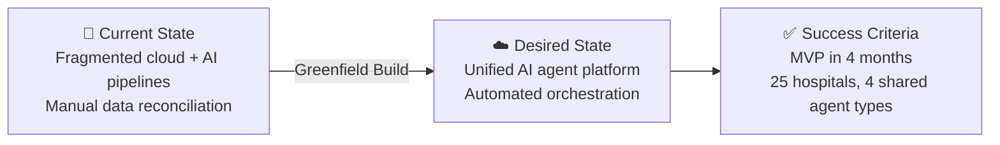

# 📋 Step 1: Requirements - CareFlow AI

<strong>📑 Requirements Overview</strong>

- [🎯 Project Overview](#-project-overview)
- [🚀 Functional Requirements](#-functional-requirements)
- [⚡ Non-Functional Requirements (NFRs)](#-non-functional-requirements-nfrs)
- [🔒 Compliance & Security Requirements](#-compliance--security-requirements)
- [💰 Budget](#-budget)
- [🔧 Operational Requirements](#-operational-requirements)
- [🌍 Regional Preferences](#-regional-preferences)
- [📊 Complexity Classification](#-complexity-classification)
- [📋 Summary for Architecture Assessment](#-summary-for-architecture-assessment)
- [References](#references)

> Generated by @requirements agent | 2026-05-19

| ⬅️ Previous | 📑 Index            | Next ➡️                                                        |
| ----------- | ------------------- | -------------------------------------------------------------- |
| —           | [README](README.md) | [02-architecture-assessment.md](02-architecture-assessment.md) |

## 🎯 Project Overview

| Field                   | Value                                                                                   |
| ----------------------- | --------------------------------------------------------------------------------------- |
| **Project Name**        | careflow-ai                                                                             |
| **Project Type**        | Data + AI Platform                                                                      |
| **Timeline**            | 2026-05 → 2026-09 (4 months to MVP)                                                     |
| **Primary Stakeholder** | CTO                                                                                     |
| **Business Context**    | AI-driven operational intelligence platform for hospitals using Azure AI Foundry agents |
| **IaC Tool**            | Bicep                                                                                   |

### Business Context

| Field               | Value                                                                                                   |
| ------------------- | ------------------------------------------------------------------------------------------------------- |
| Industry / Vertical | Healthcare                                                                                              |
| Company Size        | Startup (1-50 employees, 5 developers + 2 data engineers)                                               |
| Current State       | Greenfield                                                                                              |
| Migration Source    | N/A (greenfield)                                                                                        |
| Business Drivers    | Series A funding (€8M), move from pilot to production, hospital onboarding scalability                  |
| Success Criteria    | MVP live within 4 months, 25 hospitals onboarded, 4 shared agent types with 50-75 concurrent executions |

### State Transition

## 🚀 Functional Requirements

### Core Capabilities

| #   | Capability             | Priority  | Acceptance Criteria                                                                                                                                                                                                                                                                                                                                                                                                                                             |
| --- | ---------------------- | --------- | --------------------------------------------------------------------------------------------------------------------------------------------------------------------------------------------------------------------------------------------------------------------------------------------------------------------------------------------------------------------------------------------------------------------------------------------------------------- |
| 1   | Data Ingestion         | 🔴 Must   | Ingest hospital data via batch (Data Factory) and real-time streaming (Event Hubs)                                                                                                                                                                                                                                                                                                                                                                              |
| 2   | Data Processing        | 🔴 Must   | Transform, enrich, and prepare datasets for agent consumption                                                                                                                                                                                                                                                                                                                                                                                                   |
| 3   | AI Agent Runtime       | 🔴 Must   | Host and orchestrate AI Foundry agents (demand, anomaly, optimization, alerting)                                                                                                                                                                                                                                                                                                                                                                                |
| 4   | API Layer              | 🔴 Must   | Serve agent recommendations to hospital dashboards via API Management                                                                                                                                                                                                                                                                                                                                                                                           |
| 5   | Secrets Management     | 🔴 Must   | Centralized management of API keys, connection strings, certificates via Key Vault                                                                                                                                                                                                                                                                                                                                                                              |
| 6   | Monitoring             | 🔴 Must   | Agent execution health, latency, infrastructure metrics, and cost visibility                                                                                                                                                                                                                                                                                                                                                                                    |
| 7   | Multi-tenant Isolation | 🔴 Must   | Cross-hospital data access impossible at data layer; logical tenant isolation mandatory per GDPR Art.5(1)(f) and NEN 7510. Isolation model: shared infrastructure with Cosmos DB `hospital_id` partition key + **application-layer enforcement** (agent SDK validates partition key presence on every query; queries without it are rejected). Auditable and demonstrable to hospital DPOs. Architecture step must validate this model meets legal requirements |
| 8   | Auto-scaling           | 🟡 Should | Handle 5× volume increase when large hospital network onboards                                                                                                                                                                                                                                                                                                                                                                                                  |

### Multi-Tenancy Model

| Aspect                | Design Decision                                                               |
| --------------------- | ----------------------------------------------------------------------------- |
| Isolation Strategy    | Shared infrastructure, logical isolation at data layer                        |
| Partition Key         | `hospital_id` on Cosmos DB — all PHI queries scoped by partition key          |
| Enforcement Layer     | Application-layer (agent SDK middleware rejects queries without hospital_id)  |
| Agent Architecture    | 4 shared agent types serve all hospitals (not per-hospital instances)         |
| Context Routing       | Each API request carries `hospital_id`; agents load hospital-specific context |
| Concurrent Executions | ~50-75 parallel (25 hospitals × 2-3 active workflows each)                    |
| API Isolation         | Per-hospital APIM Subscription Keys (individual revocation + audit trail)     |
| Data Access Invariant | All Cosmos DB queries MUST include partition key equality predicate           |
| Onboarding Gate       | Hospital ingestion enabled only after DPA signed (APIM product activation)    |

> [!IMPORTANT]
> The term "cryptographic isolation" does NOT apply. Cosmos DB partition keys provide
> **logical data distribution**, not security isolation. Cross-tenant protection relies on
> the **application-layer enforcement** in the agent SDK middleware that validates every
> query is scoped to a single `hospital_id`. This must be tested via integration tests
> and demonstrable to hospital DPOs during audit.

### User Types

| User Type               | Description                           | Est. Count | Access Level |
| ----------------------- | ------------------------------------- | ---------- | ------------ |
| Platform Engineers      | Internal team managing infrastructure | 7          | Admin        |
| Hospital Administrators | Clinical operations staff             | 200+       | Contributor  |
| Hospital API Consumers  | Dashboards and integrations           | 25+        | Reader (API) |
| AI/ML Engineers         | Model and agent development           | 5          | Contributor  |

### Integrations

| System               | Direction | Protocol         | Auth Method       | SLA   |
| -------------------- | --------- | ---------------- | ----------------- | ----- |
| Hospital EHR Systems | Inbound   | REST / SFTP      | API Key + MI      | 99.9% |
| Hospital Scheduling  | Inbound   | Event / REST     | OAuth 2.0         | 99.9% |
| Hospital Billing     | Inbound   | Batch (SFTP/API) | MI                | 99.5% |
| Hospital Dashboards  | Outbound  | REST API         | OAuth 2.0 / Entra | 99.9% |
| Azure AI Foundry     | Internal  | SDK / REST       | Managed Identity  | 99.9% |

### Data Types

| Category              | Sensitivity | Est. Volume         | Retention | Residency          |
| --------------------- | ----------- | ------------------- | --------- | ------------------ |
| Patient Records       | 🔴 High     | Millions/month      | 7 years   | EU (swedencentral) |
| Clinical Scheduling   | 🟡 Medium   | Hundreds of K/month | 2 years   | EU (swedencentral) |
| Billing Data          | 🔴 High     | Hundreds of K/month | 7 years   | EU (swedencentral) |
| Agent Recommendations | 🟡 Medium   | Tens of K/day       | 1 year    | EU (swedencentral) |
| Operational Metrics   | 🟢 Low      | Continuous          | 90 days   | EU (swedencentral) |

### Architecture Pattern

| Field              | Value                                                                                                                  |
| ------------------ | ---------------------------------------------------------------------------------------------------------------------- |
| Workload Pattern   | Event-Driven with AI Agents                                                                                            |
| Recommended Option | Balanced tier with managed services (Container Apps + Event Hubs + AI Foundry + APIM)                                  |
| Tier               | Balanced                                                                                                               |
| Justification      | Startup budget constraints with healthcare SLA requirements; managed services reduce operational burden for small team |

## ⚡ Non-Functional Requirements (NFRs)

| WAF Pillar     | Metric                | Target                          | Current | Gap               |
| -------------- | --------------------- | ------------------------------- | ------- | ----------------- |
| 🔄 Reliability | SLA                   | 99.9%                           | N/A     | Full build needed |
| 🔄 Reliability | RTO                   | 4 hours                         | N/A     | Full build needed |
| 🔄 Reliability | RPO                   | 1 hour                          | N/A     | Full build needed |
| ⚡ Performance | API Response (p95)    | < 500ms                         | N/A     | Full build needed |
| ⚡ Performance | Agent Execution (p95) | < 30s                           | N/A     | Full build needed |
| ⚡ Performance | Concurrent Users      | 1,000 - 10,000                  | N/A     | Full build needed |
| ⚡ Performance | Concurrent Executions | 50-75 (4 shared agent types)    | N/A     | Full build needed |
| ⚡ Performance | Data Ingestion TPS    | 100 - 1,000                     | N/A     | Full build needed |
| 🔒 Security    | Auth Method           | Managed Identity + Entra ID     | N/A     | Full build needed |
| 🔒 Security    | Encryption            | At-rest + In-transit (TLS 1.2+) | N/A     | Full build needed |
| 💰 Cost        | Monthly Budget        | €2,000 - €5,000                 | N/A     | Full build needed |
| 🔧 Operations  | Uptime Monitoring     | Yes                             | N/A     | Full build needed |

### Scalability

| Dimension               | Current | 6-Month Projection             | 12-Month Projection |
| ----------------------- | ------- | ------------------------------ | ------------------- |
| Hospitals Onboarded     | 0       | 25                             | 50+                 |
| Daily Users             | 0       | 1,000-10,000                   | 10,000+             |
| Data Volume (monthly)   | 0       | Millions of records            | 5× (scale event)    |
| Agent Executions/day    | 0       | 9,500 (4 types × 25 hospitals) | 50,000+             |
| Transactions/sec (peak) | 0       | 1,000                          | 5,000               |

## 🔒 Compliance & Security Requirements

### Regulatory Frameworks

<strong>PCI-DSS</strong> — Not Applicable

No payment card data processed by the platform.

<strong>SOC 2</strong> — Not Applicable

Not required for MVP phase. May be considered for enterprise hospital contracts in Phase 2.

<strong>HIPAA</strong> — Not Applicable

Platform operates in EU (Netherlands). GDPR and NEN 7510 apply instead of HIPAA.

<strong>GDPR</strong> — Applicable

| Requirement                    | Applicability | Notes                                                                                                                                                                                                                                                                     |
| ------------------------------ | ------------- | ------------------------------------------------------------------------------------------------------------------------------------------------------------------------------------------------------------------------------------------------------------------------- |
| EU data subjects               | Yes           | Dutch hospital patients — EU citizens                                                                                                                                                                                                                                     |
| Data residency                 | Yes           | All data must remain in EU (swedencentral region)                                                                                                                                                                                                                         |
| Right to erasure               | Yes           | Must support data deletion requests per Article 17                                                                                                                                                                                                                        |
| Data flow classification       | Yes           | PHI must never enter Event Hubs in raw form; streams carry anonymized references only; PHI in deletable store                                                                                                                                                             |
| DPIA                           | Yes           | Data Protection Impact Assessment required before production go-live (GDPR Art.35)                                                                                                                                                                                        |
| Microsoft DPA                  | Yes           | Azure Data Protection Addendum must be reviewed and accepted before patient data ingestion                                                                                                                                                                                |
| Erasure implementation pattern | Yes           | Event Hubs carry pointer events; PHI in Cosmos DB/SQL with cascade-delete capability. Pointer events with pseudonymous references expire within 7 days (accepted residual risk per GDPR Art.17(3) technical feasibility)                                                  |
| Hospital↔CareFlow AI DPA       | Yes           | DPA template (GDPR Art.28) required between each hospital (controller) and CareFlow AI (processor) before data ingestion. Must specify: lawful basis, data categories, retention, sub-processors (Microsoft), and data subject rights. Legal prerequisite for MVP go-live |
| Azure OpenAI data handling     | Yes           | Zero-data-retention (ZDR) policy must be enabled on Azure OpenAI resources, OR all agent prompts must be PHI-free by architectural design. Model training opt-out confirmed. Sub-processor relationship evaluated against Microsoft DPA                                   |

<strong>ISO 27001</strong> — Applicable

| Control Area        | Applicability | Notes                                       |
| ------------------- | ------------- | ------------------------------------------- |
| Access control      | Yes           | RBAC + Managed Identity + Entra ID          |
| Asset management    | Yes           | Resource tagging and inventory              |
| Incident management | Yes           | Azure Monitor alerts + operational runbooks |

<strong>NEN 7510</strong> — Applicable

| Requirement                     | Applicability | Notes                                            |
| ------------------------------- | ------------- | ------------------------------------------------ |
| Healthcare information security | Yes           | Dutch standard for healthcare IT systems         |
| Access logging and auditing     | Yes           | Diagnostic settings on all resources             |
| Data classification             | Yes           | Patient data marked as highly sensitive          |
| Encryption requirements         | Yes           | TLS 1.2+ in transit, platform encryption at rest |

### Data Residency

| Requirement              | Value                                                       |
| ------------------------ | ----------------------------------------------------------- |
| Primary Region           | swedencentral                                               |
| Data Sovereignty         | EU-only (GDPR + Dutch healthcare data law compliance)       |
| Cross-region Replication | Not required for MVP (ZRS within region preferred over GRS) |

### Authentication & Authorization

| Requirement       | Value                                               |
| ----------------- | --------------------------------------------------- |
| Identity Provider | Entra ID (internal) + Entra External ID (hospitals) |
| MFA Requirement   | Required for administrative access                  |
| RBAC Model        | Azure RBAC + application-level for hospitals        |

### Network Security

| Control                     | Required | Notes                                                                   |
| --------------------------- | -------- | ----------------------------------------------------------------------- |
| Private endpoints           | ✅       | All data services (Storage, Event Hubs, Key Vault, Service Bus)         |
| VNet integration            | ✅       | Container Apps, APIM in VNet                                            |
| Public endpoints acceptable | ✅       | API Management gateway only (for hospital access)                       |
| WAF required                | ✅       | Azure Front Door WAF in Prevention mode for APIM endpoint (~€50-150/mo) |

### Recommended Security Controls

| Control               | Recommended | User Confirmed | Notes                                                                                                                                |
| --------------------- | ----------- | -------------- | ------------------------------------------------------------------------------------------------------------------------------------ |
| Managed Identity      | Yes         | Yes            | All service-to-service auth, no keys                                                                                                 |
| Private Endpoints     | Yes         | Yes            | For all data services                                                                                                                |
| WAF                   | Yes         | Yes            | Azure Front Door WAF for healthcare API protection (~€50-150/mo)                                                                     |
| Key Vault for Secrets | Yes         | Yes            | Centralized secrets, connection strings, certs                                                                                       |
| Diagnostic Settings   | Yes         | Yes            | Audit logging for NEN 7510 compliance                                                                                                |
| TLS 1.2 Minimum       | Yes         | Yes            | Enforced on all endpoints                                                                                                            |
| Encryption at Rest    | Yes         | Yes            | Platform-managed keys for MVP (accepted risk: CMK deferred pending legal review; blocker if Dutch healthcare authority mandates CMK) |
| Network Isolation     | Yes         | Yes            | VNet + NSGs + Private Link                                                                                                           |

## 💰 Budget

| Field              | Value                                               |
| ------------------ | --------------------------------------------------- |
| 💰 Monthly Budget  | ~€2,000 - €5,000                                    |
| 📅 Annual Budget   | ~€24,000 - €60,000                                  |
| 🚦 Limit Type      | 🟡 Soft (Series A funding, can negotiate for scale) |
| 📊 Cost Model Pref | Consumption (startup, pay-per-use preferred)        |

### Cost Optimization Priorities

| Priority                         | Selected | Impact |
| -------------------------------- | -------- | ------ |
| Minimize compute costs           | ☑        | High   |
| Prefer consumption-based pricing | ☑        | High   |
| Reserved instances acceptable    | ☐        | Medium |
| Spot instances for non-critical  | ☐        | Low    |

## 🔧 Operational Requirements

### Monitoring & Alerting

| Capability                | Required | Tool / Service          | Notes                                         |
| ------------------------- | -------- | ----------------------- | --------------------------------------------- |
| Application monitoring    | ✅       | Application Insights    | Agent execution telemetry                     |
| Log aggregation           | ✅       | Log Analytics           | Centralized logs from all services            |
| Alert notifications       | ✅       | Email + Teams           | Platform team + on-call rotation              |
| Custom dashboards         | ✅       | Azure Monitor Workbooks | Agent health, cost, latency                   |
| Security threat detection | ✅       | Defender for Cloud      | Breach detection, 72h notification (NEN 7510) |
| Budget alerts             | ✅       | Azure Budgets           | Alerts at 80%, 100%, 120% of monthly ceiling  |

### Support & Maintenance

| Requirement           | Value                                                                              |
| --------------------- | ---------------------------------------------------------------------------------- |
| Support Hours         | Business hours (expanding to 24/7 at scale)                                        |
| On-call Requirement   | Yes — automated breach detection alerts 24/7 (GDPR Art.33 72h notification window) |
| Maintenance Windows   | Weekends, 02:00-06:00 CET                                                          |
| Change Management     | Team approval (PR-based IaC changes via GitHub Actions CI/CD)                      |
| Incident Response     | Automated breach detection (Defender for Cloud) + 72h notification runbook to AP   |
| CI/CD Pipeline        | GitHub Actions: IaC validation (bicep lint + what-if), environment promotion gates |
| Environment Promotion | Dev → Prod requires passing all validation checks + manual approval gate           |

### Backup & Disaster Recovery

| Component     | Backup Frequency | Retention | Recovery Method        |
| ------------- | ---------------- | --------- | ---------------------- |
| Patient Data  | Continuous (ZRS) | 7 years   | Point-in-time restore  |
| Agent State   | Hourly           | 30 days   | Automated replay       |
| Configuration | On change (Git)  | Unlimited | Git restore + redeploy |
| Event Streams | 7-day retention  | 7 days    | Event Hubs replay      |

> **RTO Scope**: The 4-hour RTO applies to zone-level failures within swedencentral
> (protected by ZRS and zone-redundant services). Regional outage RTO is best-effort
> for MVP — no cross-region replication is deployed. Geo-redundant DR to
> germanywestcentral is planned for Phase 2 post-scale event.

## 🌍 Regional Preferences

| Preference         | Value              | Justification                                   |
| ------------------ | ------------------ | ----------------------------------------------- |
| Primary Region     | swedencentral      | EU GDPR-compliant, best AI feature availability |
| Failover Region    | germanywestcentral | EU paired alternative for future DR             |
| Availability Zones | Preferred          | ZRS for storage, zone-redundant Container Apps  |

---

## 📊 Complexity Classification

| Field      | Value                                                                                                                                                             |
| ---------- | ----------------------------------------------------------------------------------------------------------------------------------------------------------------- |
| Complexity | `complex`                                                                                                                                                         |
| Criteria   | >8 resource types (10 services), multi-env (Dev+Prod), healthcare compliance (GDPR+NEN 7510+ISO 27001)                                                            |
| Rationale  | 10 Azure services in scope, multiple compliance frameworks, AI agent orchestration with event-driven data pipelines, multi-hospital tenant isolation requirements |

---

## 📋 Summary for Architecture Assessment

### Handoff Summary

| Aspect               | Key Points                                                                                              |
| -------------------- | ------------------------------------------------------------------------------------------------------- |
| Critical Constraints | €2K-5K budget, GDPR/NEN 7510 compliance, 4-month timeline, tenant isolation                             |
| Key Decisions        | Bicep IaC, Event-Driven + AI Agents pattern, Balanced tier, swedencentral, PHI in deletable stores only |
| Open Risks           | 5× scale event planning, AI Foundry quota verification needed, CMK legal review pending                 |
| Recommended Pattern  | Event-Driven with AI Agents (streaming pointers → PHI store → agents → API)                             |
| Budget Envelope      | €2,000 - €5,000/month                                                                                   |

### Requirements Completeness

| Section                  | Status | Notes                                     |
| ------------------------ | ------ | ----------------------------------------- |
| Project Overview         | ✅     | Complete with business context            |
| Functional Requirements  | ✅     | 8 capabilities, integrations defined      |
| NFRs                     | ✅     | SLA, RTO, RPO, scale targets set          |
| Compliance & Security    | ✅     | GDPR + NEN 7510 + ISO 27001               |
| Budget                   | ✅     | €2K-5K/month with optimization priorities |
| Operational Requirements | ✅     | Monitoring, backup, DR defined            |

---

## References

> [!NOTE]
> 📚 The following Microsoft Learn resources provide additional guidance.

| Topic                      | Link                                                                                                |
| -------------------------- | --------------------------------------------------------------------------------------------------- |
| Well-Architected Framework | [Overview](https://learn.microsoft.com/azure/well-architected/)                                     |
| Azure Regions              | [Products by Region](https://azure.microsoft.com/explore/global-infrastructure/products-by-region/) |
| Compliance Offerings       | [Azure Compliance](https://learn.microsoft.com/azure/compliance/)                                   |
| Azure AI Foundry           | [AI Foundry Docs](https://learn.microsoft.com/azure/ai-studio/)                                     |
| NEN 7510                   | [Dutch Healthcare Security](https://www.nen.nl/nen-7510-1-2017-en-245398)                           |

---

_Requirements captured using [plan-requirements.prompt.md](../../.github/prompts/plan-requirements.prompt.md) template_

---

| ⬅️ — | 🏠 [Project Index](README.md) | ➡️ [02-architecture-assessment.md](02-architecture-assessment.md) |
| ---- | ----------------------------- | ----------------------------------------------------------------- |

