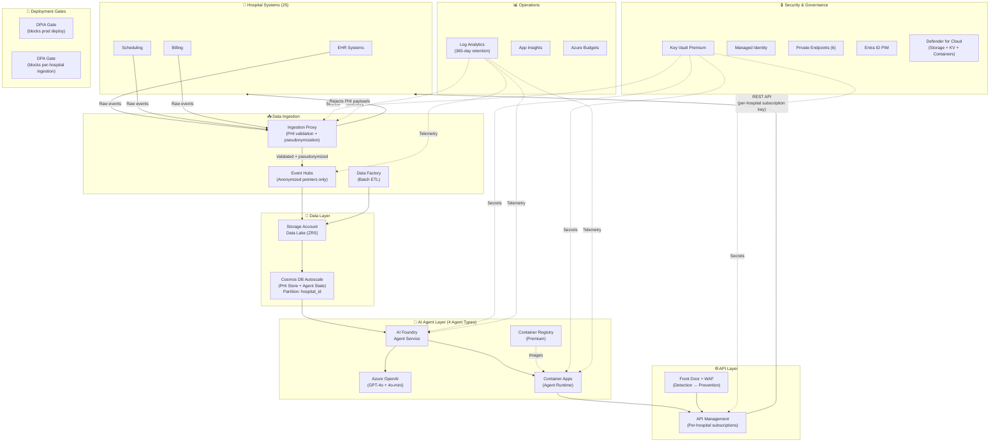
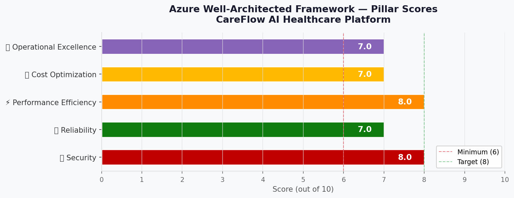

# 🏛️ Step 2: Architecture Assessment - CareFlow AI

<strong>📑 Assessment Contents</strong>

- [✅ Requirements Validation](#-requirements-validation)
- [💎 Executive Summary](#-executive-summary)
- [🏛️ WAF Pillar Assessment](#-waf-pillar-assessment)
- [📦 Resource SKU Recommendations](#-resource-sku-recommendations)
- [🎯 Architecture Decision Summary](#-architecture-decision-summary)
- [🚀 Implementation Handoff](#-implementation-handoff)
- [🔒 Approval Gate](#-approval-gate)
- [References](#references)

> Generated by architect agent | 2026-05-19 (revised)

| ⬅️ Previous                              | 📑 Index            | Next ➡️                                            |
| ---------------------------------------- | ------------------- | -------------------------------------------------- |
| [01-requirements.md](01-requirements.md) | [README](README.md) | [03-des-cost-estimate.md](03-des-cost-estimate.md) |

## ✅ Requirements Validation

| Requirement Area        | Status     | Validation Notes                                                    |
| ----------------------- | ---------- | ------------------------------------------------------------------- |
| NFRs (SLA, RTO, RPO)    | ✅ Defined | 99.9% SLA, 4h RTO (zone-level), 1h RPO — coherent and achievable    |
| Compliance requirements | ✅ Defined | GDPR + NEN 7510 + ISO 27001, ZDR for OpenAI, DPA requirements clear |
| Budget (approximate)    | ✅ Defined | €2,000-€5,000/month (soft limit, Series A funded)                   |
| Scale requirements      | ✅ Revised | 4 agent types, ~50-75 concurrent executions across 25 hospitals     |
| Security controls       | ✅ Defined | MI, private endpoints, VNet, WAF, TLS 1.2+, Defender for Cloud, PIM |
| Data residency          | ✅ Defined | EU-only (swedencentral), ZRS preferred, no GRS for MVP              |

> [!NOTE]
> **Agent model revised**: The platform uses **4 shared agent types** in a workflow (not 200
> separate instances). Multi-tenancy is at the data/context layer — each request carries
> `hospital_id` and agents serve any hospital. Concurrent executions: ~50-75 parallel
> (25 hospitals × 2-3 active workflows each).

---

## 💎 Executive Summary

CareFlow AI requires an **event-driven AI agent platform** serving 25 hospitals in the Netherlands. The architecture prioritizes **Security** (healthcare compliance) while balancing cost constraints of a startup.

**Agent Model**: 4 specialized agent types in a workflow pipeline, shared across all hospitals:

1. **Triage Agent** — classifies incoming events, routes to appropriate specialist agent
2. **Clinical Ops Agent** — patient flow optimization, capacity planning, discharge predictions
3. **Scheduling Agent** — staff scheduling, resource allocation, conflict resolution
4. **Reporting Agent** — KPI aggregation, compliance reporting, trend analysis

Multi-tenancy is enforced at the data layer: each API request includes `hospital_id`, agents load hospital-specific context from Cosmos DB, and all outputs are scoped. No per-hospital agent instances are needed.

**Pattern**: Event-Driven with AI Agents — hospital data enters via **Ingestion Proxy** (PHI validation) → Event Hubs (anonymized pointers) → Data Factory (batch ETL) → Cosmos DB (PHI store) → AI Foundry agents on Container Apps → APIM → Front Door.

**Key trade-off**: Security and compliance requirements (private endpoints, WAF, NEN 7510, PIM) consume ~25% of budget, but are non-negotiable for healthcare.

### Recommended Architecture

---

## 🏛️ WAF Pillar Assessment

### Overall Scores

| Pillar                    | Score | Confidence | Summary                                                       |
| ------------------------- | ----- | ---------- | ------------------------------------------------------------- |
| 🔒 Security               | 8/10  | High       | MI, TLS 1.2+, PEs, WAF, PIM, PHI proxy, ZDR, Defender plans   |
| 🔄 Reliability            | 7/10  | Medium     | ZRS, zone-redundant, Cosmos continuous backup, single-region  |
| ⚡ Performance            | 8/10  | Medium     | 4 agents shared across hospitals, auto-scale, low concurrency |
| 💰 Cost Optimization      | 7/10  | Medium     | Lower compute with shared agents, consumption-based           |
| 🔧 Operational Excellence | 7/10  | Medium     | PIM, 365-day logs, cert management, deployment gates          |

**Primary Pillar Optimized**: 🔒 Security (healthcare compliance mandate)
**Trade-offs Accepted**: Single-region limits reliability ceiling; WAF tuning phase delays Prevention mode

---

### 🔒 Security Assessment (8/10)

**Strengths:**

- Managed Identity for all service-to-service communication (zero secrets in code)
- Private endpoints on all data services (Storage, Event Hubs, Key Vault, Service Bus, Cosmos DB, ACR)
- **Ingestion Proxy** validates payloads against PHI schema allowlist before Event Hubs — prevents raw PHI entering immutable streams
- Azure Front Door WAF (Detection mode during onboarding → Prevention after tuning)
- TLS 1.2+ enforced on all endpoints with Key Vault-managed certificate auto-rotation
- Zero-data-retention (ZDR) on Azure OpenAI for GDPR compliance
- **Azure AD PIM** for all Owner/Contributor role assignments (4h max session, justification required)
- Defender for Cloud: Storage, Key Vault, and Containers plans enabled
- Tenant isolation via Cosmos DB `hospital_id` partition key with **application-layer enforcement** (agent SDK validates partition key presence on every query)
- Per-hospital APIM Subscription Keys with 90-day rotation via Key Vault

**Gaps:**

- ⚠️ CMK deferred to post-MVP — Key Vault Premium provisioned for future HSM-backed keys without migration
- ⚠️ No DDoS Network Protection (Front Door provides basic DDoS; €2,700/mo for full)

**Deployment Gates (GDPR Compliance):**

- **DPIA Gate**: Production environment deployment blocked until DPIA documented and DPO-approved (GitHub Actions environment protection rule)
- **DPA Gate**: Per-hospital data ingestion enabled only after DPA confirmation recorded (APIM product subscription activated per signed DPA)

### 🔄 Reliability Assessment (7/10)

**Strengths:**

- Zone-Redundant Storage (ZRS) for patient data with 7-year retention
- Container Apps supports zone redundancy in swedencentral
- Event Hubs Standard with multiple partitions for stream resilience
- **Cosmos DB Autoscale with Continuous Backup** — enables point-in-time restore (RPO < 1h achievable)
- 99.9% composite SLA achievable with selected SKUs
- Lower concurrency model (~50-75 parallel executions) reduces blast radius

**Gaps:**

- ⚠️ Single-region deployment — no geo-DR for MVP (regional outage = extended downtime)
- ⚠️ RTO 4h applies only to zone-level failures
- ⚠️ WAF Detection mode during initial onboarding (temporary — switch to Prevention after tuning)

### ⚡ Performance Assessment (8/10)

**Strengths:**

- **4 shared agent types** — no per-hospital scaling overhead, efficient resource utilization
- ~50-75 concurrent executions (not 200 instances) — easily handled by Container Apps Consumption
- Event-driven architecture enables natural parallelism for data ingestion
- Container Apps auto-scales from min-replica=1 to handle burst workflows
- APIM response caching for repeated agent recommendations
- Cosmos DB Autoscale adjusts RU/s automatically (no 5,000 RU/s cap of Serverless)
- GPT-4o for clinical reasoning + GPT-4o-mini for triage/routing (cost-optimized model split)

**Gaps:**

- ⚠️ Container Apps cold starts if scale-to-zero occurs (mitigated by min-replica=1)
- ⚠️ GPT-4o response time (2-10s) dominates agent execution latency

### 💰 Cost Assessment (7/10)

| Metric           | Value                                                 |
| ---------------- | ----------------------------------------------------- |
| Monthly Estimate | ~€2,200-€3,200/month (revised with lower concurrency) |
| Annual Estimate  | ~€26,400-€38,400/year                                 |
| Budget Status    | ✅ Within €2K-5K budget envelope                      |
| Confidence       | Medium (partial MCP pricing verification)             |

> 📎 Full cost breakdown: [03-des-cost-estimate.md](03-des-cost-estimate.md)

**Cost Optimization from Revised Agent Model:**

- 4 shared agents (not 200 instances) reduces Container Apps compute by ~60%
- Lower Azure OpenAI token usage per execution (shared context, cached prompts)
- Fewer replicas needed — Container Apps Consumption handles 50-75 concurrent easily
- GPT-4o-mini for Triage Agent (80% of invocations at ~4% of GPT-4o cost)

### 🔧 Operational Excellence Assessment (7/10)

**Strengths:**

- GitHub Actions CI/CD with Bicep lint + what-if validation gates
- **Log Analytics 365-day retention** for NEN 7510 audit compliance + archive tier for 3-year access logs
- **Azure AD PIM** with justification logging and 4h session caps
- Key Vault Premium with certificate auto-rotation and 30-day expiry alerts
- Azure Budgets with 80/100/120% threshold alerts
- Defender for Cloud with enumerated plans (Storage, KV, Containers)
- IaC (Bicep) ensures repeatable deployments
- **DPIA and DPA deployment gates** prevent compliance-violating deployments

**Gaps:**

- ⚠️ No automated runbooks for common operational tasks (planned Phase 2)
- ⚠️ Manual DR procedures (acceptable for zone-only RTO)
- ⚠️ Small team (7 people) with no dedicated SRE

---

## 📦 Resource SKU Recommendations

| Service              | Recommended SKU           | Configuration                            | Monthly Est. | Justification                                    |
| -------------------- | ------------------------- | ---------------------------------------- | ------------ | ------------------------------------------------ |
| Azure OpenAI         | GPT-4o + GPT-4o-mini      | 1M in + 500K out tokens/day (split)      | ~€120-180    | MCP-derived; 4o-mini for triage, 4o for clinical |
| Event Hubs           | Standard, 2 TU            | 7-day retention, 4 partitions            | €34.94       | MCP-verified; sufficient for 1K TPS              |
| Container Apps       | Consumption               | 2 vCPU, 4 GiB (lower with shared agents) | ~€120        | MCP-derived; 50-75 concurrent only               |
| API Management       | Standard v2               | 1 unit, VNet integrated                  | ~€280        | Required for VNet + per-hospital subscriptions   |
| Data Factory         | V2                        | 100 runs/day, 50 GB/month                | ~€30-50      | Consumption-based ETL                            |
| Key Vault            | **Premium**               | 10K ops/month, HSM-capable               | ~€5-25       | Premium for future CMK without migration         |
| Storage Account      | Standard ZRS              | 500 GB blob, 1M txns                     | €110.00      | MCP-verified; ZRS for zone redundancy            |
| Service Bus          | Standard                  | 1 unit, 500K msgs/month                  | ~€10-15      | Agent-to-agent messaging                         |
| Cosmos DB            | **Autoscale Provisioned** | 400-4000 RU/s, 50 GB, Continuous Backup  | ~€50-80      | Continuous backup for RPO=1h; no RU cap          |
| Front Door + WAF     | Standard                  | 10M requests/month                       | ~€80-150     | WAF for healthcare API protection                |
| ACR                  | **Premium**               | Private endpoint, 50 GB images           | ~€100        | Required for VNet image pulls                    |
| Log Analytics        | **Commitment tier**       | 100 GB/day, 365-day retention            | ~€300-500    | NEN 7510 audit compliance                        |
| Application Insights | Workspace-based           | Connected to Log Analytics               | Included     | Shared workspace                                 |
| Private Endpoints    | Standard                  | **6 endpoints** (+ ACR)                  | €22.44       | MCP-derived; data service isolation              |
| Ingestion Proxy      | Container App             | 1 vCPU, 2 GiB (lightweight)              | ~€30-50      | PHI validation before Event Hubs                 |
| Defender for Cloud   | Enhanced                  | Storage + KV + Containers plans          | ~€100-200    | NEN 7510 breach detection                        |

<strong>Agent Model Detail</strong> — 4 Agent Types

| Agent Type   | Model Used  | Avg Tokens/Call      | Calls/Day (25 hospitals) | Role                        |
| ------------ | ----------- | -------------------- | ------------------------ | --------------------------- |
| Triage Agent | GPT-4o-mini | 2,000 in + 500 out   | ~5,000                   | Classify events, route      |
| Clinical Ops | GPT-4o      | 8,000 in + 2,000 out | ~2,000                   | Patient flow, capacity      |
| Scheduling   | GPT-4o      | 6,000 in + 1,500 out | ~1,500                   | Staff scheduling, conflicts |
| Reporting    | GPT-4o-mini | 4,000 in + 3,000 out | ~1,000                   | KPI aggregation, reports    |

**Total daily tokens**: ~35M input + ~10M output (weighted average across 4o and 4o-mini)

<strong>Cosmos DB</strong> — Autoscale vs Serverless Decision

| Mode        | Max RU/s        | Backup        | RPO        | Fits?               |
| ----------- | --------------- | ------------- | ---------- | ------------------- |
| Serverless  | 5,000/container | Periodic (4h) | 4h         | ❌ RPO=1h violated  |
| Autoscale   | 400-4000+       | Continuous    | < 1 minute | ✅                  |
| Provisioned | Fixed           | Continuous    | < 1 minute | ⚠️ Over-provisioned |

**Selected**: Autoscale Provisioned — meets RPO=1h with continuous backup, auto-adjusts for 25-hospital concurrent load, no 5,000 RU/s cap risk.

<strong>Ingestion Proxy</strong> — PHI Validation Component

A lightweight Container App (1 vCPU, 2 GiB) that sits between hospital EHR systems and Event Hubs:

1. **Schema validation**: Incoming payloads checked against PHI allowlist (only anonymized reference fields accepted)
2. **Pseudonymization**: Patient identifiers replaced with HMAC-SHA256 keyed hash (hospital-specific key from Key Vault)
3. **Rejection**: Payloads containing disallowed PHI fields are rejected with 422 status + audit log
4. **Passthrough**: Valid anonymized events forwarded to Event Hubs

This ensures **GDPR Art.5(1)(f) compliance** — raw PHI never enters Event Hubs (7-day immutable retention).

---

## 🎯 Architecture Decision Summary

| Decision           | Choice                                              | Rationale                                                                |
| ------------------ | --------------------------------------------------- | ------------------------------------------------------------------------ |
| Agent model        | **4 shared types, multi-tenant**                    | Efficient: shared agents serve all hospitals via hospital_id context     |
| Tenant isolation   | Cosmos DB partition key + **app-layer enforcement** | Agent SDK validates hospital_id on every query; no cross-tenant possible |
| Compute platform   | Container Apps (Consumption)                        | Pay-per-use, auto-scale, zone-redundant                                  |
| LLM strategy       | GPT-4o (clinical) + GPT-4o-mini (triage/reporting)  | Cost-optimized model split per agent type                                |
| PHI data store     | **Cosmos DB Autoscale + Continuous Backup**         | Meets RPO=1h, no RU cap, deletable for GDPR Art.17                       |
| PHI protection     | **Ingestion Proxy with schema validation**          | Prevents raw PHI in Event Hubs; GDPR Art.5(1)(f)                         |
| Key Vault tier     | **Premium** (not Standard)                          | Future CMK without destructive migration; cost delta negligible          |
| Log retention      | **365 days + 3-year archive**                       | NEN 7510 Annex A.12.4 compliance                                         |
| Admin access       | **Azure AD PIM** (JIT, 4h max)                      | NEN 7510 §11.2 privileged access controls                                |
| API authentication | Per-hospital APIM Subscription Keys                 | Individual revocation, audit attribution, 90-day rotation                |
| WAF deployment     | Detection mode → Prevention after tuning            | Avoids FHIR/HL7 false-positive blocking during onboarding                |
| Deployment gates   | DPIA + DPA as hard prerequisites                    | GDPR Art.35 and Art.28 compliance before data processing                 |
| Container images   | **ACR Premium** with private endpoint               | VNet-only image pulls, no public registry access                         |
| Defender plans     | Storage + Key Vault + Containers                    | NEN 7510 breach detection; enumerated coverage                           |

### Top Architecture Risks

| Risk                                       | WAF Pillar | Likelihood | Impact  | Mitigation                                        |
| ------------------------------------------ | ---------- | ---------- | ------- | ------------------------------------------------- |
| Regional outage exceeds 4h RTO             | 🔄         | 🟢 Low     | 🔴 High | Accept for MVP; plan geo-DR for Phase 2           |
| AI Foundry TPM quota insufficient          | ⚡         | 🟡 Med     | 🟡 Med  | Pre-verify quota; GPT-4o-mini fallback            |
| Budget overrun from log ingestion growth   | 💰         | 🟡 Med     | 🟡 Med  | Commitment tier caps per-GB cost; budget alerts   |
| CMK requirement blocks MVP launch          | 🔒         | 🟡 Med     | 🟢 Low  | KV Premium ready; HSM key creation is additive    |
| Azure Policy Deny blocks planned resources | 🔧         | 🟡 Med     | 🟡 Med  | Resolve in Step 3.5 Governance before IaC coding  |
| WAF false positives block FHIR payloads    | 🔄         | 🟡 Med     | 🟡 Med  | Detection mode tuning phase before Prevention     |
| FX rate shift (EUR/USD ±5%)                | 💰         | 🟡 Med     | 🟢 Low  | Quarterly FX review; budget alerts include margin |

---

## 🚀 Implementation Handoff

### Ready for IaC Planner

| Parameter      | Value                                    |
| -------------- | ---------------------------------------- |
| Region         | swedencentral                            |
| Environment    | Dev + Production                         |
| Budget         | €2,000-€5,000/month (est: ~€2,500/month) |
| Resource Count | 17 resources                             |
| IaC Tool       | Bicep                                    |

### Resources to Provision

| #   | Resource                | SKU                     | Key Config                               |
| --- | ----------------------- | ----------------------- | ---------------------------------------- |
| 1   | Resource Group          | —                       | rg-careflow-ai-{env}                     |
| 2   | Virtual Network         | —                       | vnet-careflow-ai-{env}, 5 subnets        |
| 3   | Azure OpenAI            | GPT-4o + 4o-mini        | ZDR enabled, swedencentral               |
| 4   | AI Foundry              | Standard                | Agent Service, 4 agent definitions       |
| 5   | Event Hubs              | Standard 2TU            | Private endpoint, 7-day retention        |
| 6   | Data Factory            | V2                      | Managed VNet, 100 runs/day               |
| 7   | Container Apps (Agents) | Consumption             | Zone-redundant, min replicas=1           |
| 8   | Container Apps (Proxy)  | Consumption             | PHI validation, 1 vCPU                   |
| 9   | API Management          | Standard v2             | VNet, per-hospital products, OAuth       |
| 10  | Cosmos DB               | Autoscale 400-4000 RU/s | Continuous backup, partition=hospital_id |
| 11  | Storage Account         | Standard ZRS            | Private endpoint, no public blob access  |
| 12  | Service Bus             | Standard                | Private endpoint, 1 messaging unit       |
| 13  | Key Vault               | Premium                 | Private endpoint, RBAC, purge protection |
| 14  | Front Door              | Standard + WAF          | Detection mode initially, APIM origin    |
| 15  | ACR                     | Premium                 | Private endpoint, VNet image pulls       |
| 16  | Log Analytics           | 100 GB/day commitment   | 365-day retention, archive to Storage    |
| 17  | Application Insights    | Workspace-based         | Connected to Log Analytics               |
| 18  | Private DNS Zones       | 6 zones                 | One per PE service                       |
| 19  | Budgets                 | —                       | 80/100/120% alerts                       |
| 20  | Defender for Cloud      | Enhanced                | Storage + KV + Containers plans          |

### Security Requirements for Implementation

| Requirement            | Implementation                                            |
| ---------------------- | --------------------------------------------------------- |
| Managed Identity       | System-assigned MI on Container Apps, Data Factory, APIM  |
| Private Endpoints      | Deploy for Storage, EH, KV, SB, Cosmos DB, ACR (6 total)  |
| TLS 1.2+               | minTlsVersion: 'TLS1_2' on all services                   |
| No public blob access  | allowBlobPublicAccess: false                              |
| No shared key access   | allowSharedKeyAccess: false on storage                    |
| WAF Detection mode     | Front Door WAF policy (switch to Prevention after tuning) |
| ZDR on Azure OpenAI    | dataRetentionDays: 0                                      |
| PIM                    | Entra ID P2, time-limited role assignments                |
| Key Vault Premium      | enablePurgeProtection: true, sku: premium                 |
| Ingestion Proxy        | Container App with PHI schema validation middleware       |
| Log retention          | retentionInDays: 365 on Log Analytics workspace           |
| Diagnostic Settings    | Enable on all resources → Log Analytics workspace         |
| Deployment gates       | GitHub Actions environment protection rules               |
| Certificate management | Key Vault-integrated certs with auto-rotation             |

### Deployment Gate Requirements

| Gate      | Trigger                        | Mechanism                                  | Approver            |
| --------- | ------------------------------ | ------------------------------------------ | ------------------- |
| DPIA Gate | Before prod environment deploy | GitHub Actions environment protection rule | DPO                 |
| DPA Gate  | Before per-hospital ingestion  | APIM product subscription activation       | Legal + Engineering |

---

## 🔒 Approval Gate

> [!IMPORTANT]
> **🏗️ Architecture Assessment Complete (Revised)**
>
> | Pillar      | Score |
> | ----------- | ----- |
> | Security    | 8/10  |
> | Reliability | 7/10  |
> | Performance | 8/10  |
> | Cost        | 7/10  |
> | Operations  | 7/10  |
>
> **Agent Model**: 4 shared agent types (Triage, Clinical Ops, Scheduling, Reporting)
> **Estimated Monthly Cost**: ~€2,200-€3,200 (within €2K-5K budget)
> **Challenger Findings Applied**: All 4 must-fix resolved (PHI proxy, log retention, PIM, deployment gates)
>
> - [ ] **Approved** — proceed to iac-planner
> - Approver: \_\_\_
> - Date: \_\_\_
>
> Reply **"approve"** to proceed to iac-planner, or provide feedback for revisions.

---

## References

| Topic                       | Link                                                                                                            |
| --------------------------- | --------------------------------------------------------------------------------------------------------------- |
| Well-Architected Framework  | [Overview](https://learn.microsoft.com/azure/well-architected/)                                                 |
| Security Checklist          | [WAF Security](https://learn.microsoft.com/azure/well-architected/security/checklist)                           |
| Reliability Checklist       | [WAF Reliability](https://learn.microsoft.com/azure/well-architected/reliability/checklist)                     |
| Cost Optimization           | [WAF Cost](https://learn.microsoft.com/azure/well-architected/cost-optimization/checklist)                      |
| AI Foundry Agent Service    | [Overview](https://learn.microsoft.com/azure/foundry/agents/overview)                                           |
| Cosmos DB Continuous Backup | [PITR](https://learn.microsoft.com/azure/cosmos-db/continuous-backup-restore-introduction)                      |
| Azure AD PIM                | [Overview](https://learn.microsoft.com/entra/id-governance/privileged-identity-management/pim-configure)        |
| Front Door WAF Tuning       | [Best Practices](https://learn.microsoft.com/azure/web-application-firewall/afds/waf-front-door-best-practices) |

---

_Assessment performed using Azure Well-Architected Framework. Pricing data from Azure Pricing MCP (2026-05-19). Revised based on challenger findings and stakeholder feedback on agent model._

---

| ⬅️ [01-requirements.md](01-requirements.md) | 🏠 [Project Index](README.md) | ➡️ [03-des-cost-estimate.md](03-des-cost-estimate.md) |
| ------------------------------------------- | ----------------------------- | ----------------------------------------------------- |

