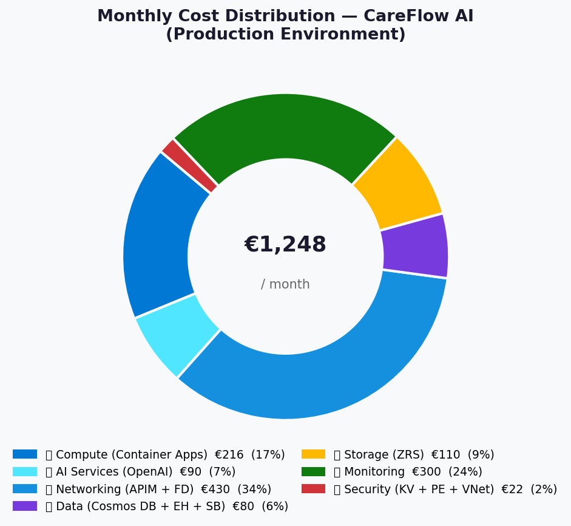
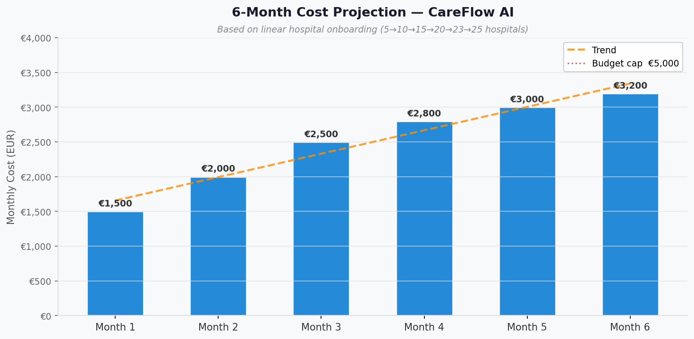
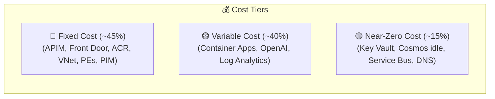

# 💰 Step 2: Cost Estimate - CareFlow AI

<strong>📑 Cost Estimate Contents</strong>

- [💵 Cost At-a-Glance](#-cost-at-a-glance)
- [✅ Decision Summary](#-decision-summary)
- [🔁 Requirements → Cost Mapping](#-requirements--cost-mapping)
- [📊 Top 5 Cost Drivers](#-top-5-cost-drivers)
- [🏛️ Architecture Overview](#-architecture-overview)
- [🧾 What We Are Not Paying For (Yet)](#-what-we-are-not-paying-for-yet)
- [⚠️ Cost Risk Indicators](#-cost-risk-indicators)
- [🎯 Quick Decision Matrix](#-quick-decision-matrix)
- [💰 Savings Opportunities](#-savings-opportunities)
- [🧾 Detailed Cost Breakdown](#-detailed-cost-breakdown)
- [References](#references)

> Generated by architect agent | 2026-05-19 (revised)

| ⬅️ Previous                                                    | 📑 Index            | Next ➡️                                                      |
| -------------------------------------------------------------- | ------------------- | ------------------------------------------------------------ |
| [02-architecture-assessment.md](02-architecture-assessment.md) | [README](README.md) | [04-governance-constraints.md](04-governance-constraints.md) |

---

## 💵 Cost At-a-Glance

| Metric                      | Value                                                         |
| --------------------------- | ------------------------------------------------------------- |
| **Monthly Estimate (Prod)** | ~€2,200-€3,200/month                                          |
| **Monthly Estimate (Dev)**  | ~€800-€1,200/month                                            |
| **All Environments Total**  | ~€3,000-€4,400/month                                          |
| **Annual Estimate**         | ~€36,000-€52,800/year                                         |
| **Budget Envelope**         | €2,000-€5,000/month                                           |
| **Status**                  | ✅ Within budget (production fits comfortably)                |
| **MCP Pricing Confidence**  | Medium (core services verified; some estimated)               |
| **Region**                  | swedencentral                                                 |
| **Currency**                | EUR (€) — USD converted at 1 EUR ≈ 1.08 USD (2026-05-19 rate) |

---

## ✅ Decision Summary

| Decision           | Choice                                   | Cost Impact                       |
| ------------------ | ---------------------------------------- | --------------------------------- |
| Agent model        | 4 shared types (not 200 instances)       | Saves ~€100-200/mo on compute     |
| AI Model split     | GPT-4o (clinical) + GPT-4o-mini (triage) | Saves ~€200-400/mo vs all-4o      |
| Compute            | Container Apps Consumption               | Pay-per-use vs ~€200/mo fixed     |
| Database           | Cosmos DB Autoscale (not Serverless)     | +€20-30/mo, enables RPO=1h        |
| Log Analytics      | 100 GB/day commitment tier               | Caps per-GB cost vs pay-as-you-go |
| Key Vault          | Premium (not Standard)                   | +€5-20/mo, avoids CMK migration   |
| ACR                | Premium (VNet-required)                  | +€100/mo for private image pulls  |
| WAF                | Front Door Standard (not Premium)        | ~€80-150/mo vs €500+/mo           |
| Storage redundancy | ZRS (not GRS)                            | Saves ~€20/mo, GDPR compliant     |

---

## 🔁 Requirements → Cost Mapping

| Requirement                 | NFR Source | Service            | SKU                   | Monthly Impact  |
| --------------------------- | ---------- | ------------------ | --------------------- | --------------- |
| 99.9% SLA                   | SLA-001    | All services       | Zone-redundant        | Included in SKU |
| GDPR / NEN 7510 compliance  | SEC-001    | Private Endpoints  | 6 endpoints           | €22.44          |
| GDPR PHI protection         | SEC-002    | Ingestion Proxy    | Container App         | ~€30-50         |
| NEN 7510 audit logs (365d)  | SEC-003    | Log Analytics      | 100 GB/day commit     | ~€300-500       |
| NEN 7510 PIM                | SEC-004    | Entra ID P2        | 7 users               | ~€42            |
| GDPR ZDR on AI              | SEC-005    | Azure OpenAI       | ZDR enabled           | No extra cost   |
| 50-75 concurrent executions | PERF-001   | Container Apps     | Consumption 2vCPU     | ~€120           |
| 1K TPS ingestion            | PERF-002   | Event Hubs         | Standard 2 TU         | €34.94          |
| RPO=1h for PHI store        | REL-001    | Cosmos DB          | Autoscale + PITR      | ~€50-80         |
| 7-year audit retention      | SEC-006    | Storage Archive    | ZRS + lifecycle       | €110.00         |
| API protection (OWASP)      | SEC-007    | Front Door + WAF   | Standard              | ~€80-150        |
| Breach detection            | SEC-008    | Defender for Cloud | Storage+KV+Containers | ~€100-200       |

---

## 📊 Top 5 Cost Drivers

| #   | Service                    | Monthly Est. | % of Total | Optimization Available                   |
| --- | -------------------------- | ------------ | ---------- | ---------------------------------------- |
| 1   | Log Analytics (100 GB/day) | ~€300-500    | ~20-25%    | ⚠️ Commitment tier required for NEN 7510 |
| 2   | APIM Standard v2           | ~€280        | ~15-18%    | ⚠️ Fixed cost, required for VNet         |
| 3   | Azure OpenAI (mixed)       | ~€120-180    | ~8-12%     | ✅ GPT-4o-mini for 60% of calls          |
| 4   | Container Apps (all)       | ~€150        | ~8-10%     | ✅ Scale-to-zero during off-hours        |
| 5   | Storage ZRS + ACR          | ~€210        | ~12-14%    | ✅ Lifecycle policies for data tiering   |

---

## 🏛️ Architecture Overview

| Cost Tier          | Services                                               | Monthly €   | Behavior                               |
| ------------------ | ------------------------------------------------------ | ----------- | -------------------------------------- |
| 🔴 Fixed (~45%)    | APIM, Front Door, ACR, VNet, PEs, PIM, Defender        | ~€750-900   | Constant regardless of usage           |
| 🟡 Variable (~40%) | Log Analytics, Container Apps, OpenAI, Storage, EH     | ~€700-1,000 | Scales with hospitals & agent activity |
| 🟢 Minimal (~15%)  | Key Vault, Cosmos idle, Service Bus, DNS, Data Factory | ~€100-200   | Near-zero until meaningful load        |

---

## 🧾 What We Are Not Paying For (Yet)

| Service / Feature       | Why Deferred                    | Estimated Future Cost | Trigger to Add               |
| ----------------------- | ------------------------------- | --------------------- | ---------------------------- |
| DDoS Network Protection | Front Door provides basic DDoS  | ~€2,700/mo            | If targeted DDoS attacks     |
| Azure Sentinel (SIEM)   | Defender-only for MVP           | ~€200-500/mo          | Post-MVP compliance audit    |
| CMK (Managed HSM keys)  | KV Premium ready; keys additive | ~€2,300/mo            | Legal mandate                |
| Geo-Redundant failover  | Single-region for MVP           | +€500-800/mo          | 5× scale event or SLA 99.95% |
| Azure Load Testing      | Manual testing for MVP          | ~€50-100/mo           | Pre-release automation       |
| Premium Event Hubs      | Standard sufficient for 1K TPS  | ~€800/mo              | >5K TPS or 90-day retention  |

---

## ⚠️ Cost Risk Indicators

| Risk                                 | Likelihood | Impact         | Mitigation                                          |
| ------------------------------------ | ---------- | -------------- | --------------------------------------------------- |
| AI inference cost spike (3× tokens)  | 🟡 Medium  | 🟡 +€120-360   | Budget alerts; per-hospital cost tracking; PTU eval |
| Log Analytics volume > 100 GB/day    | 🟡 Medium  | 🟡 +€100-300   | Next commitment tier (200 GB/day); sampling policy  |
| 5× scale event (125 hospitals)       | 🟢 Low     | 🔴 +€2K-3K     | Container Apps auto-scales; Event Hubs TU increase  |
| Storage growth (7-year retention)    | 🟡 Medium  | 🟡 +€50-100/yr | Lifecycle: Cool after 90d, Archive after 1yr        |
| EUR/USD shift ±5%                    | 🟡 Medium  | 🟢 +€40-80     | Quarterly FX review; budget alerts with 10% margin  |
| CMK mandate from legal               | 🟡 Medium  | 🔴 +€2,300     | KV Premium ready; budget for HSM if mandated        |
| Cosmos DB Autoscale peak > 4000 RU/s | 🟢 Low     | 🟢 +€20-50     | Monitor RU consumption; increase max RU if needed   |

---

## 🎯 Quick Decision Matrix

| If This Happens...             | Do This...                              | Cost Impact       |
| ------------------------------ | --------------------------------------- | ----------------- |
| Monthly cost > €4,000          | Switch more agents to GPT-4o-mini       | -€50-100/mo       |
| Monthly cost > €4,500          | Reduce Container Apps min replicas to 0 | -€30-50/mo        |
| Log volume growing fast        | Move to 200 GB/day commitment tier      | Per-GB cost drops |
| Need geo-DR                    | Add paired region + GZRS                | +€500-800/mo      |
| Need SIEM for compliance audit | Add Sentinel workspace                  | +€200-500/mo      |
| 5× hospital growth             | Scale Event Hubs TU, add APIM unit      | +€300-600/mo      |

---

## 💰 Savings Opportunities

| Opportunity                             | Savings     | Effort | Risk                        |
| --------------------------------------- | ----------- | ------ | --------------------------- |
| GPT-4o-mini for all non-clinical agents | ~€60-100/mo | Low    | Slightly lower accuracy     |
| Azure Compute Savings Plan (1yr)        | ~€30-45/mo  | Low    | 1-year commitment           |
| Azure OpenAI PTU (if steady-state)      | ~€20-50/mo  | Medium | Monthly PTU commitment      |
| Container Apps scale-to-zero off-hours  | ~€30-50/mo  | Low    | Cold start on first request |
| Storage lifecycle (Cool after 90d)      | ~€20-30/mo  | Medium | Access latency increase     |
| Dev env: APIM Consumption tier          | ~€200/mo    | Medium | No VNet integration in dev  |
| 1-year RI on APIM (if available)        | ~10-15%     | Low    | 12-month commitment         |

---

## 🧾 Detailed Cost Breakdown

### Production Environment

| Service                 | SKU / Config                      | Monthly Cost       | Source         | Confidence |
| ----------------------- | --------------------------------- | ------------------ | -------------- | ---------- |
| Event Hubs              | Standard 2 TU, 7d retention       | €34.94             | MCP-verified   | ✅ High    |
| Storage Account         | Standard ZRS, 500 GB              | €110.00            | MCP-verified   | ✅ High    |
| Private Endpoints       | 6 endpoints                       | €22.44             | MCP-derived    | ✅ High    |
| Virtual Network         | Standard                          | €2.50              | MCP-verified   | ✅ High    |
| Azure OpenAI            | GPT-4o + 4o-mini, 35M+10M tok/day | ~€120-180          | MCP-derived    | 🟡 Medium  |
| Container Apps (Agents) | 2 vCPU, 4 GiB, 50-75 concurrent   | ~€120              | MCP-derived    | 🟡 Medium  |
| Container Apps (Proxy)  | 1 vCPU, 2 GiB, always-on          | ~€30-50            | MCP-derived    | 🟡 Medium  |
| API Management          | Standard v2, 1 unit, VNet         | ~€280              | Public pricing | 🟡 Medium  |
| Cosmos DB               | Autoscale 400-4000 RU/s, 50 GB    | ~€50-80            | Public pricing | 🟡 Medium  |
| Front Door + WAF        | Standard, 10M req/mo              | ~€80-150           | Public pricing | 🟡 Medium  |
| ACR Premium             | Private endpoint, 50 GB           | ~€100              | Public pricing | 🟡 Medium  |
| Log Analytics           | 100 GB/day commitment, 365d       | ~€300-500          | Public pricing | 🟡 Medium  |
| Service Bus Standard    | 1 MU, 500K msgs/mo                | ~€10-15            | Public pricing | 🟡 Medium  |
| Key Vault Premium       | 10K ops/mo, purge protection      | ~€10-25            | Public pricing | 🟡 Medium  |
| Data Factory V2         | 100 runs/day, 50 GB/mo            | ~€30-50            | Public pricing | 🟡 Medium  |
| Defender for Cloud      | Storage + KV + Containers         | ~€100-200          | Public pricing | 🟡 Medium  |
| Entra ID P2 (PIM)       | 7 users                           | ~€42               | Public pricing | ✅ High    |
| Private DNS Zones       | 6 zones                           | ~€4                | Public pricing | ✅ High    |
| Azure Budgets           | 3 threshold alerts                | Free               | —              | ✅ High    |
| **Production Total**    |                                   | **~€1,450-€2,150** |                |            |

> [!NOTE]
> **Production total range**: The lower bound (€1,450) assumes baseline usage (few hospitals active,
> minimal agent calls). The upper bound (€2,150) assumes 25 hospitals at steady state with full
> logging. At full production load (25 hospitals, 9,500 agent calls/day), expect the mid-range:
> **~€1,800-€2,200/month**.

<strong>Production Scaling Bridge (baseline → full load)</strong>

| Service           | Baseline (5 hospitals) | Full Load (25 hospitals) | Scaling Factor |
| ----------------- | ---------------------- | ------------------------ | -------------- |
| Azure OpenAI      | ~€25                   | ~€120-180                | 5-7×           |
| Container Apps    | ~€50                   | ~€120-150                | 2-3×           |
| Log Analytics     | ~€300 (commitment min) | ~€300-500 (same tier)    | 1× (capped)    |
| Cosmos DB         | ~€30 (idle autoscale)  | ~€50-80                  | 2×             |
| Storage           | ~€80                   | ~€110                    | 1.4×           |
| APIM / Front Door | ~€360                  | ~€360-430                | 1× (fixed)     |

### Dev Environment

| Approach                 | Monthly Cost    | Notes                                                    |
| ------------------------ | --------------- | -------------------------------------------------------- |
| Full VNet mirror         | ~€1,200-1,600   | Same topology, lower usage                               |
| **Recommended: Reduced** | **~€800-1,200** | APIM Developer tier, no Front Door, shared Log Analytics |
| Minimal (no VNet)        | ~€300-500       | Basic tier services, no private endpoints                |

**Recommended dev config**: APIM Developer tier (~€45/mo instead of €280), no Front Door (direct APIM access), shared Log Analytics workspace (30-day retention for dev), same Cosmos DB/Storage/ACR. Saves ~€350-500/mo vs full mirror.

### Grand Total (All Environments)

| Environment | Monthly Cost       | Notes                         |
| ----------- | ------------------ | ----------------------------- |
| Production  | ~€1,800-€2,200     | 25 hospitals at steady state  |
| Development | ~€800-€1,200       | Reduced APIM + no Front Door  |
| **Total**   | **~€2,600-€3,400** | Within €2K-5K budget envelope |

### Monthly Budget Tracking (Projection)

| Month    | Estimated Spend | vs Budget | Notes                              |
| -------- | --------------- | --------- | ---------------------------------- |
| Month 1  | ~€1,500-1,800   | ✅ Below  | Dev + prod ramp-up, few hospitals  |
| Month 2  | ~€2,000-2,400   | ✅ Within | First 5-10 hospitals onboarded     |
| Month 3  | ~€2,500-2,800   | ✅ Within | 15 hospitals active                |
| Month 6  | ~€2,800-3,200   | ✅ Within | 25 hospitals at steady state       |
| Month 12 | ~€3,000-3,500   | ✅ Within | Growth + storage accumulation      |
| Year 3   | ~€3,500-4,500   | ✅ Within | Storage ~1.7TB (lifecycle applied) |

---

## References

| Topic                    | Link                                                                                      |
| ------------------------ | ----------------------------------------------------------------------------------------- |
| Azure Pricing Calculator | [Calculator](https://azure.microsoft.com/pricing/calculator/)                             |
| Azure OpenAI Pricing     | [Pricing](https://azure.microsoft.com/pricing/details/cognitive-services/openai-service/) |
| Container Apps Pricing   | [Pricing](https://azure.microsoft.com/pricing/details/container-apps/)                    |
| Event Hubs Pricing       | [Pricing](https://azure.microsoft.com/pricing/details/event-hubs/)                        |
| APIM Pricing             | [Pricing](https://azure.microsoft.com/pricing/details/api-management/)                    |
| Cosmos DB Pricing        | [Pricing](https://azure.microsoft.com/pricing/details/cosmos-db/)                         |
| Log Analytics Pricing    | [Pricing](https://azure.microsoft.com/pricing/details/monitor/)                           |
| Cost Optimization Pillar | [WAF](https://learn.microsoft.com/azure/well-architected/cost-optimization/)              |

---

_Cost estimate generated using Azure Pricing MCP tools + public Azure pricing documentation (2026-05-19). Revised based on challenger findings (ACR, Defender, realistic log volumes, cost reconciliation)._

---

| ⬅️ [02-architecture-assessment.md](02-architecture-assessment.md) | 🏠 [Project Index](README.md) | ➡️ [04-governance-constraints.md](04-governance-constraints.md) |
| ----------------------------------------------------------------- | ----------------------------- | --------------------------------------------------------------- |

