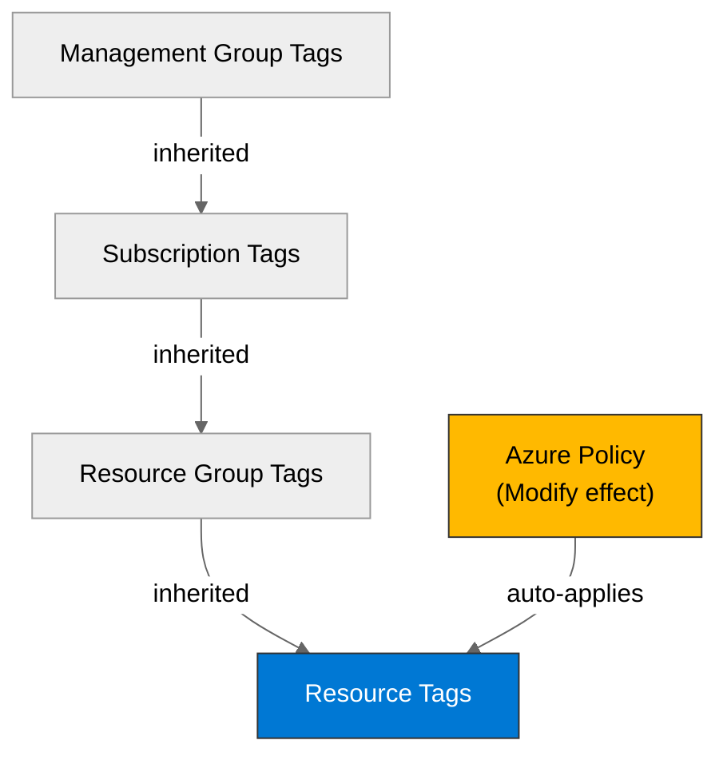

# 🛡️ Governance Constraints - careflow-ai

<strong>📑 Governance Contents</strong>

- [🔍 Discovery Source](#-discovery-source)
- [📋 Azure Policy Compliance](#-azure-policy-compliance)
- [🔄 Plan Adaptations Based on Policies](#-plan-adaptations-based-on-policies)
- [🚫 Deployment Blockers](#-deployment-blockers)
- [🏷️ Required Tags](#-required-tags)
- [🔐 Security Policies](#-security-policies)
- [💰 Cost Policies](#-cost-policies)
- [🌐 Network Policies](#-network-policies)
- [📜 Compliance Frameworks](#-compliance-frameworks)
- [References](#references)

> Generated by 04g-Governance agent | 2026-05-19T18:43:49Z

| ⬅️ Previous                                                    | 📑 Index            | Next ➡️                                                |
| -------------------------------------------------------------- | ------------------- | ------------------------------------------------------ |
| [02-architecture-assessment.md](02-architecture-assessment.md) | [README](README.md) | [04-implementation-plan.md](04-implementation-plan.md) |

## 🔍 Discovery Source

| Query              | Results               | Timestamp            |
| ------------------ | --------------------- | -------------------- |
| Policy Assignments | 7 policies discovered | 2026-05-19T18:43:49Z |
| Tag Policies       | 1 tags required       | 2026-05-19T18:43:49Z |
| Security Policies  | 1 constraints         | 2026-05-19T18:43:49Z |

**Discovery Method**: Azure Policy REST API (discover.py)
**Subscription**: 9c798369-76c6-47fb-888d-17b37f06d85a
**Scope**: Subscription + management-group inherited

> ⚠️ **7 deployment blocker(s)** detected. Review the [Deployment Blockers](#-deployment-blockers) section before proceeding to IaC planning.

### Policy Definition Analysis

| Policy Display Name                                                                                                   | Assignment Scope                                                                      | Effect            | Classification | Category                                 | Bicep Property Path                           | Required Value                                      |
| --------------------------------------------------------------------------------------------------------------------- | ------------------------------------------------------------------------------------- | ----------------- | -------------- | ---------------------------------------- | --------------------------------------------- | --------------------------------------------------- |
| Block Azure RM Resource Creation                                                                                      | /providers/Microsoft.Management/managementGroups/f0b9af07-2731-4a6d-984a-3a2e96a90fc2 | deny              | blocker        | Uncategorized                            |                                               |                                                     |
| Deploy the Windows Guest Configuration extension to enable Guest Configuration assignments on Windows VMs             | /providers/Microsoft.Management/managementGroups/f0b9af07-2731-4a6d-984a-3a2e96a90fc2 | deployIfNotExists | auto-remediate | Guest Configuration                      | virtualMachines::extensions/provisioningState |                                                     |
| Add system-assigned managed identity to enable Guest Configuration assignments on virtual machines with no identities | /providers/Microsoft.Management/managementGroups/f0b9af07-2731-4a6d-984a-3a2e96a90fc2 | modify            | auto-remediate | Managed Identity for Guest Configuration | virtualMachines::storageProfile.osDisk.osType | SystemAssigned                                      |
| Add system-assigned managed identity to enable Guest Configuration assignments on VMs with a user-assigned identity   | /providers/Microsoft.Management/managementGroups/f0b9af07-2731-4a6d-984a-3a2e96a90fc2 | modify            | auto-remediate | Managed identity for Guest Configuration | virtualMachines::storageProfile.osDisk.osType | [concat(field('identity.type'), ',SystemAssigned')] |
| Ensure secure access to storage account containers                                                                    | /providers/Microsoft.Management/managementGroups/f0b9af07-2731-4a6d-984a-3a2e96a90fc2 | modify            | auto-remediate | Modify Allow Blob anonymous access       | resourceGroups::tags                          | false                                               |
| Deploy Resource Group McapsGovernance                                                                                 | /providers/Microsoft.Management/managementGroups/f0b9af07-2731-4a6d-984a-3a2e96a90fc2 | deployIfNotExists | auto-remediate | Uncategorized                            |                                               |                                                     |
| Deploy Storage Account for Diagnostic Settings                                                                        | /providers/Microsoft.Management/managementGroups/f0b9af07-2731-4a6d-984a-3a2e96a90fc2 | deployIfNotExists | auto-remediate | Uncategorized                            |                                               |                                                     |
| Block VM SKU Sizes                                                                                                    | /providers/Microsoft.Management/managementGroups/f0b9af07-2731-4a6d-984a-3a2e96a90fc2 | deny              | blocker        | Compute                                  |                                               |                                                     |
| Deny AKS deployment with agent pool count greater than 10                                                             | /providers/Microsoft.Management/managementGroups/f0b9af07-2731-4a6d-984a-3a2e96a90fc2 | deny              | blocker        | Compute                                  | managedClusters::agentPoolProfiles[*]         |                                                     |
| Deny VMSS deployment with instance count greater than 10                                                              | /providers/Microsoft.Management/managementGroups/f0b9af07-2731-4a6d-984a-3a2e96a90fc2 | deny              | blocker        | Compute                                  | virtualMachineScaleSets::sku.capacity         |                                                     |
| Block Azure OpenAI Provisioned Capacity                                                                               | /providers/Microsoft.Management/managementGroups/f0b9af07-2731-4a6d-984a-3a2e96a90fc2 | deny              | blocker        | Cognitive Services                       | accounts/deployments::sku.name                |                                                     |
| Block Azure Sentinel Commitment over 100                                                                              | /providers/Microsoft.Management/managementGroups/f0b9af07-2731-4a6d-984a-3a2e96a90fc2 | deny              | blocker        | Monitoring                               | workspaces::sku.capacityReservationLevel      |                                                     |
| Deny Azure Key Vault Managed HSM with Purge Protection Enabled                                                        | /providers/Microsoft.Management/managementGroups/f0b9af07-2731-4a6d-984a-3a2e96a90fc2 | deny              | blocker        | Key Vault                                |                                               |                                                     |

## 📋 Azure Policy Compliance

| Category                                 | Constraint                                                                                                            | Implementation                                                                                        | Status |
| ---------------------------------------- | --------------------------------------------------------------------------------------------------------------------- | ----------------------------------------------------------------------------------------------------- | ------ |
| Cognitive Services                       | Block Azure OpenAI Provisioned Capacity                                                                               | Use PAYG `Standard` SKU on all OpenAI deployments; PTU/Provisioned SKU is blocked by policy           | ❌ |
| Compute                                  | Block VM SKU Sizes                                                                                                    | Not applicable — no Azure VMs in architecture; Container Apps Consumption used                        | ✅     |
| Compute                                  | Deny AKS deployment with agent pool count greater than 10                                                             | Not applicable — Container Apps used, not AKS                                                         | ✅     |
| Compute                                  | Deny VMSS deployment with instance count greater than 10                                                              | Not applicable — no VMSS in architecture                                                              | ✅     |
| Guest Configuration                      | Deploy the Windows Guest Configuration extension to enable Guest Configuration assignments on Windows VMs             | Not applicable — no Azure VMs; policy targets VM extensions only                                      | ✅     |
| Key Vault                                | Deny Azure Key Vault Managed HSM with Purge Protection Enabled                                                        | Not applicable — uses Key Vault Premium (vaults), not Managed HSM                                     | ✅     |
| Managed Identity for Guest Configuration | Add system-assigned managed identity to enable Guest Configuration assignments on virtual machines with no identities | Not applicable — no Azure VMs in architecture                                                         | ✅     |
| Managed identity for Guest Configuration | Add system-assigned managed identity to enable Guest Configuration assignments on VMs with a user-assigned identity   | Not applicable — no Azure VMs in architecture                                                         | ✅     |
| Modify Allow Blob anonymous access       | Ensure secure access to storage account containers                                                                    | Aligned — `allowBlobPublicAccess: false` enforced in Bicep; policy auto-confirms this setting         | ✅     |
| Monitoring                               | Block Azure Sentinel Commitment over 100                                                                              | Cap Log Analytics `capacityReservationLevel` ≤ 100 GB/day; use `PerGB2018` SKU to avoid boundary risk | ❌ |
| Uncategorized                            | Block Azure RM Resource Creation                                                                                      | Not applicable — all resources are ARM-based; no Classic Azure resources                              | ✅     |
| Uncategorized                            | Deploy Resource Group McapsGovernance                                                                                 | Auto-deployed by policy at subscription scope; no IaC action required                                 | ✅     |
| Uncategorized                            | Deploy Storage Account for Diagnostic Settings                                                                        | Auto-deployed; verify it does not conflict with private DNS zones for Storage Account                 | ✅     |

## 🔄 Plan Adaptations Based on Policies

### Architectural Changes

| Original Design                                                   | Blocking Policy                                                | Effect | Target Resource Types                                                                                                                                                                                                                                                                                  | Adaptation Applied                                                                         |
| ----------------------------------------------------------------- | -------------------------------------------------------------- | ------ | ------------------------------------------------------------------------------------------------------------------------------------------------------------------------------------------------------------------------------------------------------------------------------------------------------ | ------------------------------------------------------------------------------------------ |
| Not applicable — no Classic resources in architecture             | Block Azure RM Resource Creation                               | deny   | Microsoft.MarketplaceApps/classicDevServices, Microsoft.ClassicCompute/domainNames, Microsoft.ClassicStorage/storageAccounts, Microsoft.ClassicNetwork/virtualNetworks, Microsoft.ClassicCompute/virtualMachines, Microsoft.ClassicNetwork/reservedIps, Microsoft.ClassicNetwork/networkSecurityGroups | No architecture change needed; all resources use ARM                                       |
| Not applicable — no Azure VMs in architecture                     | Block VM SKU Sizes                                             | deny   |                                                                                                                                                                                                                                                                                                        | No architecture change needed; Container Apps Consumption used                             |
| Not applicable — Container Apps used, not AKS                     | Deny AKS deployment with agent pool count greater than 10      | deny   | Microsoft.ContainerService/managedClusters                                                                                                                                                                                                                                                             | No architecture change needed                                                              |
| Not applicable — no VMSS in architecture                          | Deny VMSS deployment with instance count greater than 10       | deny   | Microsoft.Compute/virtualMachineScaleSets                                                                                                                                                                                                                                                              | No architecture change needed                                                              |
| **APPLIES** — Azure OpenAI (GPT-4o + GPT-4o-mini) in architecture | Block Azure OpenAI Provisioned Capacity                        | deny   | Microsoft.CognitiveServices/accounts/deployments                                                                                                                                                                                                                                                       | Set `sku: { name: 'Standard' }` on all OpenAI deployments; do NOT use `ProvisionedManaged` |
| **RISK** — Log Analytics workspace in architecture                | Block Azure Sentinel Commitment over 100                       | deny   | Microsoft.OperationalInsights/workspaces                                                                                                                                                                                                                                                               | Use `sku: { name: 'PerGB2018' }` or cap `capacityReservationLevel` ≤ 100                   |
| Not applicable — Key Vault Premium (vaults) used, not Managed HSM | Deny Azure Key Vault Managed HSM with Purge Protection Enabled | deny   | Microsoft.KeyVault/managedHSMs                                                                                                                                                                                                                                                                         | No architecture change needed                                                              |

### Auto-Applied Resources

| Policy                                                                                                    | Effect            | Auto-Applied Resource                                                                                          |
| --------------------------------------------------------------------------------------------------------- | ----------------- | -------------------------------------------------------------------------------------------------------------- |
| Deploy the Windows Guest Configuration extension to enable Guest Configuration assignments on Windows VMs | DeployIfNotExists | Not applicable — no Azure VMs deployed by CareFlow AI                                                          |
| Deploy Resource Group McapsGovernance                                                                     | DeployIfNotExists | Auto-creates `McapsGovernance` RG at subscription scope; no IaC action required                                |
| Deploy Storage Account for Diagnostic Settings                                                            | DeployIfNotExists | Auto-creates diagnostic storage account; verify private DNS zone for `blob.core.windows.net` is not duplicated |

### Auto-Modified Configurations

| Policy                                                                                                                | Effect | Auto-Applied Change                                                                         |
| --------------------------------------------------------------------------------------------------------------------- | ------ | ------------------------------------------------------------------------------------------- |
| Add system-assigned managed identity to enable Guest Configuration assignments on virtual machines with no identities | Modify | Not applicable — no Azure VMs in architecture                                               |
| Add system-assigned managed identity to enable Guest Configuration assignments on VMs with a user-assigned identity   | Modify | Not applicable — no Azure VMs in architecture                                               |
| Ensure secure access to storage account containers                                                                    | Modify | Aligned — policy enforces `allowBlobPublicAccess: false`; already set in Bicep; no conflict |

## 🚫 Deployment Blockers

> **7** blocker finding(s) from **7** unique policies (duplicates from multi-scope inheritance are consolidated below).

### Block Azure RM Resource Creation

- **Policy ID**: `/providers/Microsoft.Management/managementGroups/f0b9af07-2731-4a6d-984a-3a2e96a90fc2/providers/Microsoft.Authorization/policyDefinitions/ed63769c-6bc1-4e04-90b4-094656a08cde`
- **Effect**: deny
- **Scope**: /providers/Microsoft.Management/managementGroups/f0b9af07-2731-4a6d-984a-3a2e96a90fc2
- **Category**: Uncategorized
- **Bicep Property Path**: ``
- **Required Value**: N/A — parameter values not available in cached baseline; run `--refresh` for live lookup

**Architecture applicability**: ✅ Not applicable — CareFlow AI uses ARM-only resources. Classic Azure resources (Classic Compute, Network, Storage) are not in the design.
**Resolution**: No IaC change required.

- **Policy ID**: `/providers/Microsoft.Management/managementGroups/f0b9af07-2731-4a6d-984a-3a2e96a90fc2/providers/Microsoft.Authorization/policyDefinitions/VirtualMachine_SKU_Deny`
- **Effect**: deny
- **Scope**: /providers/Microsoft.Management/managementGroups/f0b9af07-2731-4a6d-984a-3a2e96a90fc2
- **Category**: Compute
- **Bicep Property Path**: ``
- **Required Value**: N/A — parameter values not available in cached baseline; run `--refresh` for live lookup

**Architecture applicability**: ✅ Not applicable — Container Apps Consumption tier is the only compute layer. No Azure VMs are provisioned.
**Resolution**: No IaC change required.

### Deny AKS deployment with agent pool count greater than 10

- **Policy ID**: `/providers/Microsoft.Management/managementGroups/f0b9af07-2731-4a6d-984a-3a2e96a90fc2/providers/Microsoft.Authorization/policyDefinitions/AKS_LimitNodeCount_Deny`
- **Effect**: deny
- **Scope**: /providers/Microsoft.Management/managementGroups/f0b9af07-2731-4a6d-984a-3a2e96a90fc2
- **Category**: Compute
- **Bicep Property Path**: `managedClusters::agentPoolProfiles[*]`
- **Required Value**: N/A — parameter values not available in cached baseline; run `--refresh` for live lookup

**Architecture applicability**: ✅ Not applicable — Container Apps Consumption is used instead of AKS. No `Microsoft.ContainerService/managedClusters` resource will be deployed.
**Resolution**: No IaC change required.

- **Policy ID**: `/providers/Microsoft.Management/managementGroups/f0b9af07-2731-4a6d-984a-3a2e96a90fc2/providers/Microsoft.Authorization/policyDefinitions/VMSS_LimitNodesCount_Deny`
- **Effect**: deny
- **Scope**: /providers/Microsoft.Management/managementGroups/f0b9af07-2731-4a6d-984a-3a2e96a90fc2
- **Category**: Compute
- **Bicep Property Path**: `virtualMachineScaleSets::sku.capacity`
- **Required Value**: N/A — parameter values not available in cached baseline; run `--refresh` for live lookup

**Architecture applicability**: ✅ Not applicable — no `Microsoft.Compute/virtualMachineScaleSets` resources in the architecture.
**Resolution**: No IaC change required.

- **Policy ID**: `/providers/Microsoft.Management/managementGroups/f0b9af07-2731-4a6d-984a-3a2e96a90fc2/providers/Microsoft.Authorization/policyDefinitions/AzureOpenAI_ProvisionedCapacity_Deny`
- **Effect**: deny
- **Scope**: /providers/Microsoft.Management/managementGroups/f0b9af07-2731-4a6d-984a-3a2e96a90fc2
- **Category**: Cognitive Services
- **Bicep Property Path**: `accounts/deployments::sku.name`
- **Required Value**: N/A — parameter values not available in cached baseline; run `--refresh` for live lookup

**Architecture applicability**: ❗ **APPLIES** — Azure OpenAI (GPT-4o + GPT-4o-mini) is in the architecture as `Microsoft.CognitiveServices/accounts/deployments`.

**Required IaC change**:

- Set `sku: { name: 'Standard' }` on all Azure OpenAI deployment resources
- Do NOT use `ProvisionedManaged`, `DataZoneProvisionedManaged`, or `GlobalProvisionedManaged` SKU names
- Bicep path: `accounts/deployments::sku.name` must equal `Standard`

**Cost impact**: PAYG pricing (per-token) instead of reserved PTU. Architecture cost estimate (€120–180/month) already assumes PAYG — no cost delta.

- **Policy ID**: `/providers/Microsoft.Management/managementGroups/f0b9af07-2731-4a6d-984a-3a2e96a90fc2/providers/Microsoft.Authorization/policyDefinitions/Sentinel_Commitment_Deny`
- **Effect**: deny
- **Scope**: /providers/Microsoft.Management/managementGroups/f0b9af07-2731-4a6d-984a-3a2e96a90fc2
- **Category**: Monitoring
- **Bicep Property Path**: `workspaces::sku.capacityReservationLevel`
- **Required Value**: N/A — parameter values not available in cached baseline; run `--refresh` for live lookup

**Architecture applicability**: ⚠️ **RISK** — Log Analytics workspace with 100 GB/day commitment tier is in the architecture. This policy blocks `capacityReservationLevel > 100`.

**Assessment**: Architecture specifies exactly 100 GB/day. If the policy blocks values > 100, then exactly 100 may be permitted at the boundary. However, this is a boundary risk that should be avoided.

**Recommended IaC change**:

- Use `sku: { name: 'PerGB2018' }` (pay-per-GB, no commitment reservation) to eliminate boundary risk
- OR verify with subscription owner that `capacityReservationLevel: 100` is explicitly permitted
- Do NOT set `capacityReservationLevel` above 100 under any circumstances

**Cost impact**: Switching to PerGB2018 eliminates the policy boundary risk. At MVP scale (well below 100 GB/day), PerGB2018 (~€2.30/GB in swedencentral) is cheaper than the 100 GB/day commitment tier (~€2,230/month fixed). At production scale approaching 100 GB/day, the commitment tier would be ~65% cheaper but is blocked by policy — revisit with subscription owner at production scale.

- **Policy ID**: `/providers/Microsoft.Management/managementGroups/f0b9af07-2731-4a6d-984a-3a2e96a90fc2/providers/Microsoft.Authorization/policyDefinitions/KeyVaultManagedHSM_PurgeProtectionEnabled_Deny`
- **Effect**: deny
- **Scope**: /providers/Microsoft.Management/managementGroups/f0b9af07-2731-4a6d-984a-3a2e96a90fc2
- **Category**: Key Vault
- **Bicep Property Path**: ``
- **Required Value**: N/A — parameter values not available in cached baseline; run `--refresh` for live lookup

**Architecture applicability**: ✅ Not applicable — architecture uses `Microsoft.KeyVault/vaults` (Key Vault Premium), not `Microsoft.KeyVault/managedHSMs`.
**Resolution**: No IaC change required. CMK/HSM capability is provided by Key Vault Premium without requiring Managed HSM.

## 🏷️ Required Tags

All resources must include the following tags:

> **Note**: Tag names could not be resolved from cached baseline data. Run discovery with `--refresh` for live tag policy resolution.
> **Fallback**: Until live resolution is run, all CareFlow AI Bicep templates MUST include the AGENTS.md mandatory baseline tags as a minimum. MCAPSGov policy may enforce additional tags.

| Tag Name      | Source Policy                                                                 | IaC Action Required     |
| ------------- | ----------------------------------------------------------------------------- | ----------------------- |
| `Environment` | AGENTS.md baseline (mandatory) + likely MCAPSGov policy                       | ✅ Add to all resources |
| `ManagedBy`   | AGENTS.md baseline (mandatory)                                                | ✅ Add to all resources |
| `Project`     | AGENTS.md baseline (mandatory)                                                | ✅ Add to all resources |
| `Owner`       | AGENTS.md baseline (mandatory)                                                | ✅ Add to all resources |
| [unresolved]  | MCAPSGov Deploy and Modify Policies — run `--refresh` for full key resolution | ⚠️ Run live discovery   |

## 🔐 Security Policies

| Policy                                                         | Effect | Status                                                  |
| -------------------------------------------------------------- | ------ | ------------------------------------------------------- |
| Deny Azure Key Vault Managed HSM with Purge Protection Enabled | deny   | ✅ N/A — Key Vault Premium vaults used, not Managed HSM |

## 💰 Cost Policies

| Policy                                                    | Effect | Constraint            |
| --------------------------------------------------------- | ------ | --------------------- |
| Block VM SKU Sizes                                        | deny   | See policy parameters |
| Deny AKS deployment with agent pool count greater than 10 | deny   | See policy parameters |
| Deny VMSS deployment with instance count greater than 10  | deny   | See policy parameters |
| Block Azure OpenAI Provisioned Capacity                   | deny   | See policy parameters |
| Block Azure Sentinel Commitment over 100                  | deny   | See policy parameters |

## 🌐 Network Policies

No network-specific policies discovered.

## 📜 Compliance Frameworks

> These audit/compliance assignments are active at subscription or management-group scope.
> While they do not block deployments (audit effect), they may impose architecture constraints
> (data residency, encryption, access logging, network segmentation).

| Assignment                                                                          | Scope                                                                                 | Type             |
| ----------------------------------------------------------------------------------- | ------------------------------------------------------------------------------------- | ---------------- | --- | ------------------------------------ | ------------------------------------------------------------------------------------- | ---------------- |
| Azure Security Baseline                                                             | /providers/Microsoft.Management/managementGroups/f0b9af07-2731-4a6d-984a-3a2e96a90fc2 | management-group |
| Microsoft Azure Multi Factor Authentication Enforcement for Resource Write Actions  | /providers/Microsoft.Management/managementGroups/f0b9af07-2731-4a6d-984a-3a2e96a90fc2 | management-group |
| Microsoft Azure Multi Factor Authentication Enforcement for Resource Delete Actions | /providers/Microsoft.Management/managementGroups/f0b9af07-2731-4a6d-984a-3a2e96a90fc2 | management-group |     | MCAPSGov Audit Policies (initiative) | /providers/Microsoft.Management/managementGroups/f0b9af07-2731-4a6d-984a-3a2e96a90fc2 | management-group |

> ⚠️ **MCAPSGov Audit Policies** contains approximately 20 policy definitions (audit/auditIfNotExists effect). These do not block deployments but may trigger compliance findings post-deployment for uncovered controls. Run `discover.py --refresh` to enumerate all definitions. Key domains likely covered: encryption at rest, diagnostic settings retention, access logging, network segmentation.
>
> **MFA Policies (CI/CD clarification)**: MFA enforcement targets interactive user sign-ins via Conditional Access and does NOT apply to service principals or managed identities. Automated CI/CD deployments using a service principal (OIDC) are exempt — no pipeline impact.
>
> **Healthcare Regulatory Note**: NEN 7510 (statutory for Dutch healthcare) and GDPR Article 32/44 compliance cannot be fully verified from Azure Policy assignments alone. Operational controls for PHI access logging, pseudonymization, breach notification, and data residency confirmation must be validated separately before production go-live. Tag this as a pre-production gate for the Step 7 (As-Built) agent.

## References

| Topic          | Link                                                                                                                       |
| -------------- | -------------------------------------------------------------------------------------------------------------------------- |
| Azure Policy   | [Overview](https://learn.microsoft.com/azure/governance/policy/overview)                                                   |
| Tag Governance | [Tagging Strategy](https://learn.microsoft.com/azure/cloud-adoption-framework/ready/azure-best-practices/resource-tagging) |

---

_Governance constraints discovered from Azure Policy REST API via discover.py._
