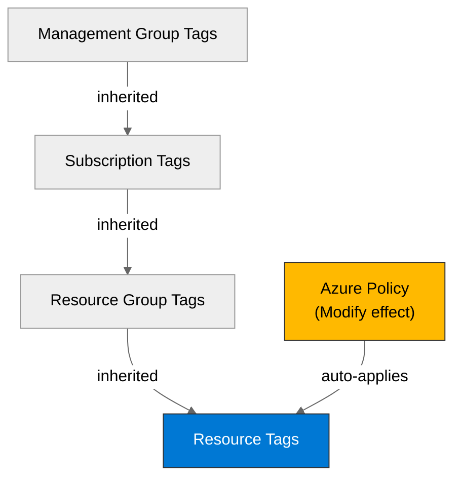

# 🛡️ Governance Constraints - careflow-ai

<strong>📑 Governance Contents</strong>

- [🔍 Discovery Source](#-discovery-source)
- [📋 Azure Policy Compliance](#-azure-policy-compliance)
- [🔄 Plan Adaptations Based on Policies](#-plan-adaptations-based-on-policies)
- [🚫 Deployment Blockers](#-deployment-blockers)
- [🏷️ Required Tags](#-required-tags)
- [🔐 Security Policies](#-security-policies)
- [💰 Cost Policies](#-cost-policies)
- [🌐 Network Policies](#-network-policies)
- [📜 Compliance Frameworks](#-compliance-frameworks)
- [References](#references)

> Generated by 04g-Governance agent | 2026-05-19T18:43:49Z

| ⬅️ Previous | 📑 Index | Next ➡️ |
| --- | --- | --- |
| [02-architecture-assessment.md](02-architecture-assessment.md) | [README](README.md) | [04-implementation-plan.md](04-implementation-plan.md) |

## 🔍 Discovery Source

| Query | Results | Timestamp |
| --- | --- | --- |
| Policy Assignments | 7 policies discovered | 2026-05-19T18:43:49Z |
| Tag Policies | 1 tags required | 2026-05-19T18:43:49Z |
| Security Policies | 1 constraints | 2026-05-19T18:43:49Z |

**Discovery Method**: Azure Policy REST API (discover.py)
**Subscription**: 9c798369-76c6-47fb-888d-17b37f06d85a
**Scope**: Subscription + management-group inherited

> ⚠️ **7 deployment blocker(s)** detected. Review the [Deployment Blockers](#-deployment-blockers) section before proceeding to IaC planning.

### Policy Definition Analysis

| Policy Display Name | Assignment Scope | Effect | Classification | Category | Bicep Property Path | Required Value |
| --- | --- | --- | --- | --- | --- | --- |
| Block Azure RM Resource Creation | /providers/Microsoft.Management/managementGroups/f0b9af07-2731-4a6d-984a-3a2e96a90fc2 | deny | blocker | Uncategorized |  |  |
| Deploy the Windows Guest Configuration extension to enable Guest Configuration assignments on Windows VMs | /providers/Microsoft.Management/managementGroups/f0b9af07-2731-4a6d-984a-3a2e96a90fc2 | deployIfNotExists | auto-remediate | Guest Configuration | virtualMachines::extensions/provisioningState |  |
| Add system-assigned managed identity to enable Guest Configuration assignments on virtual machines with no identities | /providers/Microsoft.Management/managementGroups/f0b9af07-2731-4a6d-984a-3a2e96a90fc2 | modify | auto-remediate | Managed Identity for Guest Configuration | virtualMachines::storageProfile.osDisk.osType | SystemAssigned |
| Add system-assigned managed identity to enable Guest Configuration assignments on VMs with a user-assigned identity | /providers/Microsoft.Management/managementGroups/f0b9af07-2731-4a6d-984a-3a2e96a90fc2 | modify | auto-remediate | Managed identity for Guest Configuration | virtualMachines::storageProfile.osDisk.osType | [concat(field('identity.type'), ',SystemAssigned')] |
| Ensure secure access to storage account containers | /providers/Microsoft.Management/managementGroups/f0b9af07-2731-4a6d-984a-3a2e96a90fc2 | modify | auto-remediate | Modify Allow Blob anonymous access | resourceGroups::tags | false |
| Deploy Resource Group McapsGovernance | /providers/Microsoft.Management/managementGroups/f0b9af07-2731-4a6d-984a-3a2e96a90fc2 | deployIfNotExists | auto-remediate | Uncategorized |  |  |
| Deploy Storage Account for Diagnostic Settings | /providers/Microsoft.Management/managementGroups/f0b9af07-2731-4a6d-984a-3a2e96a90fc2 | deployIfNotExists | auto-remediate | Uncategorized |  |  |
| Block VM SKU Sizes | /providers/Microsoft.Management/managementGroups/f0b9af07-2731-4a6d-984a-3a2e96a90fc2 | deny | blocker | Compute |  |  |
| Deny AKS deployment with agent pool count greater than 10 | /providers/Microsoft.Management/managementGroups/f0b9af07-2731-4a6d-984a-3a2e96a90fc2 | deny | blocker | Compute | managedClusters::agentPoolProfiles[*] |  |
| Deny VMSS deployment with instance count greater than 10 | /providers/Microsoft.Management/managementGroups/f0b9af07-2731-4a6d-984a-3a2e96a90fc2 | deny | blocker | Compute | virtualMachineScaleSets::sku.capacity |  |
| Block Azure OpenAI Provisioned Capacity | /providers/Microsoft.Management/managementGroups/f0b9af07-2731-4a6d-984a-3a2e96a90fc2 | deny | blocker | Cognitive Services | accounts/deployments::sku.name |  |
| Block Azure Sentinel Commitment over 100 | /providers/Microsoft.Management/managementGroups/f0b9af07-2731-4a6d-984a-3a2e96a90fc2 | deny | blocker | Monitoring | workspaces::sku.capacityReservationLevel |  |
| Deny Azure Key Vault Managed HSM with Purge Protection Enabled | /providers/Microsoft.Management/managementGroups/f0b9af07-2731-4a6d-984a-3a2e96a90fc2 | deny | blocker | Key Vault |  |  |

## 📋 Azure Policy Compliance

| Category | Constraint | Implementation | Status |
| --- | --- | --- | --- |
| Cognitive Services | Block Azure OpenAI Provisioned Capacity | <!-- annotate --> | ❌ |
| Compute | Block VM SKU Sizes | <!-- annotate --> | ❌ |
| Compute | Deny AKS deployment with agent pool count greater than 10 | <!-- annotate --> | ❌ |
| Compute | Deny VMSS deployment with instance count greater than 10 | <!-- annotate --> | ❌ |
| Guest Configuration | Deploy the Windows Guest Configuration extension to enable Guest Configuration assignments on Windows VMs | <!-- annotate --> | ✅ |
| Key Vault | Deny Azure Key Vault Managed HSM with Purge Protection Enabled | <!-- annotate --> | ❌ |
| Managed Identity for Guest Configuration | Add system-assigned managed identity to enable Guest Configuration assignments on virtual machines with no identities | <!-- annotate --> | ✅ |
| Managed identity for Guest Configuration | Add system-assigned managed identity to enable Guest Configuration assignments on VMs with a user-assigned identity | <!-- annotate --> | ✅ |
| Modify Allow Blob anonymous access | Ensure secure access to storage account containers | <!-- annotate --> | ✅ |
| Monitoring | Block Azure Sentinel Commitment over 100 | <!-- annotate --> | ❌ |
| Uncategorized | Block Azure RM Resource Creation | <!-- annotate --> | ❌ |
| Uncategorized | Deploy Resource Group McapsGovernance | <!-- annotate --> | ✅ |
| Uncategorized | Deploy Storage Account for Diagnostic Settings | <!-- annotate --> | ✅ |

## 🔄 Plan Adaptations Based on Policies

### Architectural Changes

| Original Design | Blocking Policy | Effect | Target Resource Types | Adaptation Applied |
| --- | --- | --- | --- | --- |
| <!-- check applicability --> | Block Azure RM Resource Creation | deny | Microsoft.MarketplaceApps/classicDevServices, Microsoft.ClassicCompute/domainNames, Microsoft.ClassicStorage/storageAccounts, Microsoft.ClassicNetwork/virtualNetworks, Microsoft.ClassicCompute/virtualMachines, Microsoft.ClassicNetwork/reservedIps, Microsoft.ClassicNetwork/networkSecurityGroups | <!-- AGENT: annotate below --> |
| <!-- check applicability --> | Block VM SKU Sizes | deny |  | <!-- AGENT: annotate below --> |
| <!-- check applicability --> | Deny AKS deployment with agent pool count greater than 10 | deny | Microsoft.ContainerService/managedClusters | <!-- AGENT: annotate below --> |
| <!-- check applicability --> | Deny VMSS deployment with instance count greater than 10 | deny | Microsoft.Compute/virtualMachineScaleSets | <!-- AGENT: annotate below --> |
| <!-- check applicability --> | Block Azure OpenAI Provisioned Capacity | deny | Microsoft.CognitiveServices/accounts/deployments | <!-- AGENT: annotate below --> |
| <!-- check applicability --> | Block Azure Sentinel Commitment over 100 | deny | Microsoft.OperationalInsights/workspaces | <!-- AGENT: annotate below --> |
| <!-- check applicability --> | Deny Azure Key Vault Managed HSM with Purge Protection Enabled | deny | Microsoft.KeyVault/managedHSMs | <!-- AGENT: annotate below --> |

### Auto-Applied Resources

| Policy | Effect | Auto-Applied Resource |
| --- | --- | --- |
| Deploy the Windows Guest Configuration extension to enable Guest Configuration assignments on Windows VMs | DeployIfNotExists | <!-- AGENT: annotate below --> |
| Deploy Resource Group McapsGovernance | DeployIfNotExists | <!-- AGENT: annotate below --> |
| Deploy Storage Account for Diagnostic Settings | DeployIfNotExists | <!-- AGENT: annotate below --> |

### Auto-Modified Configurations

| Policy | Effect | Auto-Applied Change |
| --- | --- | --- |
| Add system-assigned managed identity to enable Guest Configuration assignments on virtual machines with no identities | Modify | <!-- AGENT: annotate below --> |
| Add system-assigned managed identity to enable Guest Configuration assignments on VMs with a user-assigned identity | Modify | <!-- AGENT: annotate below --> |
| Ensure secure access to storage account containers | Modify | <!-- AGENT: annotate below --> |

## 🚫 Deployment Blockers

> **7** blocker finding(s) from **7** unique policies (duplicates from multi-scope inheritance are consolidated below).

### Block Azure RM Resource Creation

- **Policy ID**: `/providers/Microsoft.Management/managementGroups/f0b9af07-2731-4a6d-984a-3a2e96a90fc2/providers/Microsoft.Authorization/policyDefinitions/ed63769c-6bc1-4e04-90b4-094656a08cde`
- **Effect**: deny
- **Scope**: /providers/Microsoft.Management/managementGroups/f0b9af07-2731-4a6d-984a-3a2e96a90fc2
- **Category**: Uncategorized
- **Bicep Property Path**: ``
- **Required Value**: N/A — parameter values not available in cached baseline; run `--refresh` for live lookup

<!-- AGENT: annotate resolution options below -->

### Block VM SKU Sizes

- **Policy ID**: `/providers/Microsoft.Management/managementGroups/f0b9af07-2731-4a6d-984a-3a2e96a90fc2/providers/Microsoft.Authorization/policyDefinitions/VirtualMachine_SKU_Deny`
- **Effect**: deny
- **Scope**: /providers/Microsoft.Management/managementGroups/f0b9af07-2731-4a6d-984a-3a2e96a90fc2
- **Category**: Compute
- **Bicep Property Path**: ``
- **Required Value**: N/A — parameter values not available in cached baseline; run `--refresh` for live lookup

<!-- AGENT: annotate resolution options below -->

### Deny AKS deployment with agent pool count greater than 10

- **Policy ID**: `/providers/Microsoft.Management/managementGroups/f0b9af07-2731-4a6d-984a-3a2e96a90fc2/providers/Microsoft.Authorization/policyDefinitions/AKS_LimitNodeCount_Deny`
- **Effect**: deny
- **Scope**: /providers/Microsoft.Management/managementGroups/f0b9af07-2731-4a6d-984a-3a2e96a90fc2
- **Category**: Compute
- **Bicep Property Path**: `managedClusters::agentPoolProfiles[*]`
- **Required Value**: N/A — parameter values not available in cached baseline; run `--refresh` for live lookup

<!-- AGENT: annotate resolution options below -->

### Deny VMSS deployment with instance count greater than 10

- **Policy ID**: `/providers/Microsoft.Management/managementGroups/f0b9af07-2731-4a6d-984a-3a2e96a90fc2/providers/Microsoft.Authorization/policyDefinitions/VMSS_LimitNodesCount_Deny`
- **Effect**: deny
- **Scope**: /providers/Microsoft.Management/managementGroups/f0b9af07-2731-4a6d-984a-3a2e96a90fc2
- **Category**: Compute
- **Bicep Property Path**: `virtualMachineScaleSets::sku.capacity`
- **Required Value**: N/A — parameter values not available in cached baseline; run `--refresh` for live lookup

<!-- AGENT: annotate resolution options below -->

### Block Azure OpenAI Provisioned Capacity

- **Policy ID**: `/providers/Microsoft.Management/managementGroups/f0b9af07-2731-4a6d-984a-3a2e96a90fc2/providers/Microsoft.Authorization/policyDefinitions/AzureOpenAI_ProvisionedCapacity_Deny`
- **Effect**: deny
- **Scope**: /providers/Microsoft.Management/managementGroups/f0b9af07-2731-4a6d-984a-3a2e96a90fc2
- **Category**: Cognitive Services
- **Bicep Property Path**: `accounts/deployments::sku.name`
- **Required Value**: N/A — parameter values not available in cached baseline; run `--refresh` for live lookup

<!-- AGENT: annotate resolution options below -->

### Block Azure Sentinel Commitment over 100

- **Policy ID**: `/providers/Microsoft.Management/managementGroups/f0b9af07-2731-4a6d-984a-3a2e96a90fc2/providers/Microsoft.Authorization/policyDefinitions/Sentinel_Commitment_Deny`
- **Effect**: deny
- **Scope**: /providers/Microsoft.Management/managementGroups/f0b9af07-2731-4a6d-984a-3a2e96a90fc2
- **Category**: Monitoring
- **Bicep Property Path**: `workspaces::sku.capacityReservationLevel`
- **Required Value**: N/A — parameter values not available in cached baseline; run `--refresh` for live lookup

<!-- AGENT: annotate resolution options below -->

### Deny Azure Key Vault Managed HSM with Purge Protection Enabled

- **Policy ID**: `/providers/Microsoft.Management/managementGroups/f0b9af07-2731-4a6d-984a-3a2e96a90fc2/providers/Microsoft.Authorization/policyDefinitions/KeyVaultManagedHSM_PurgeProtectionEnabled_Deny`
- **Effect**: deny
- **Scope**: /providers/Microsoft.Management/managementGroups/f0b9af07-2731-4a6d-984a-3a2e96a90fc2
- **Category**: Key Vault
- **Bicep Property Path**: ``
- **Required Value**: N/A — parameter values not available in cached baseline; run `--refresh` for live lookup

<!-- AGENT: annotate resolution options below -->

## 🏷️ Required Tags

All resources must include the following tags:

> **Note**: Some tag names could not be resolved from cached policy data. Run with `--refresh` for full tag resolution.

| Tag Name | Source Policy |
| --- | --- |
| [unresolved] | MCAPSGov Deploy and Modify Policies — tag key requires live discovery |

## 🔐 Security Policies

| Policy | Effect | Status |
| --- | --- | --- |
| Deny Azure Key Vault Managed HSM with Purge Protection Enabled | deny | ❌ |

## 💰 Cost Policies

| Policy | Effect | Constraint |
| --- | --- | --- |
| Block VM SKU Sizes | deny | See policy parameters |
| Deny AKS deployment with agent pool count greater than 10 | deny | See policy parameters |
| Deny VMSS deployment with instance count greater than 10 | deny | See policy parameters |
| Block Azure OpenAI Provisioned Capacity | deny | See policy parameters |
| Block Azure Sentinel Commitment over 100 | deny | See policy parameters |

## 🌐 Network Policies

No network-specific policies discovered.

## 📜 Compliance Frameworks

> These audit/compliance assignments are active at subscription or management-group scope. 
> While they do not block deployments (audit effect), they may impose architecture constraints 
> (data residency, encryption, access logging, network segmentation).

| Assignment | Scope | Type |
| --- | --- | --- |
| Azure Security Baseline | /providers/Microsoft.Management/managementGroups/f0b9af07-2731-4a6d-984a-3a2e96a90fc2 | management-group |
| Microsoft Azure Multi Factor Authentication Enforcement for Resource Write Actions | /providers/Microsoft.Management/managementGroups/f0b9af07-2731-4a6d-984a-3a2e96a90fc2 | management-group |
| Microsoft Azure Multi Factor Authentication Enforcement for Resource Delete Actions | /providers/Microsoft.Management/managementGroups/f0b9af07-2731-4a6d-984a-3a2e96a90fc2 | management-group |

## References

| Topic | Link |
| --- | --- |
| Azure Policy | [Overview](https://learn.microsoft.com/azure/governance/policy/overview) |
| Tag Governance | [Tagging Strategy](https://learn.microsoft.com/azure/cloud-adoption-framework/ready/azure-best-practices/resource-tagging) |

---

_Governance constraints discovered from Azure Policy REST API via discover.py._

