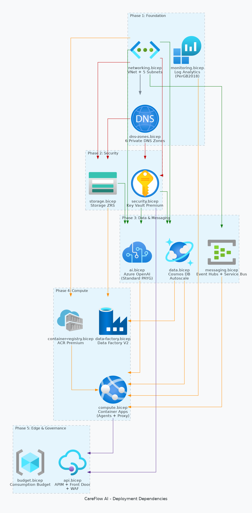
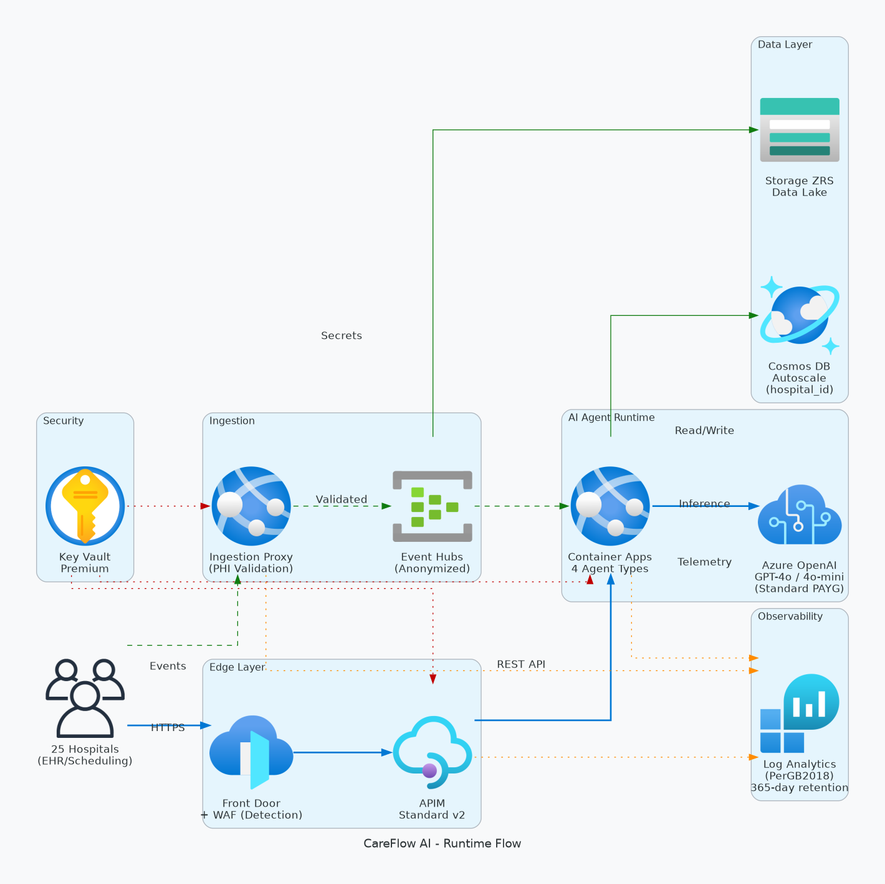

# 📀 Step 4: Implementation Plan - CareFlow AI


<details open>
<summary><strong>📑 Implementation Contents</strong></summary>

- [📋 Overview](#-overview)
- [📦 Resource Inventory](#-resource-inventory)
- [🗂️ Module Structure](#-module-structure)
- [🔨 Implementation Tasks](#-implementation-tasks)
- [🚀 Deployment Phases](#-deployment-phases)
- [🔗 Dependency Graph](#-dependency-graph)
- [🔄 Runtime Flow Diagram](#-runtime-flow-diagram)
- [🏷️ Naming Conventions](#-naming-conventions)
- [🔐 Security Configuration](#-security-configuration)
- [⏱️ Estimated Implementation Time](#-estimated-implementation-time)
- [🔒 Approval Gate](#-approval-gate)
- [References](#references)

</details>

> Generated by IaC Planner agent | 2026-05-19

| ⬅️ Previous                                                  | 📑 Index            | Next ➡️                                        |
| ------------------------------------------------------------ | ------------------- | ---------------------------------------------- |
| [04-governance-constraints.md](04-governance-constraints.md) | [README](README.md) | [04-preflight-check.md](04-preflight-check.md) |

## 📋 Overview

Implementation plan for CareFlow AI — an event-driven AI agent platform serving 25 Dutch hospitals. Deploys 20 Azure resources using Bicep with Azure Verified Modules (AVM). All resources comply with MCAPSGov governance policies (2 architecture-applicable Deny constraints resolved).

**Concurrency model**: 4 shared agent types process ~50-75 concurrent workflow executions across 25 hospitals. Pipeline: Triage (GPT-4o-mini, 80% of calls) → specialist agent (GPT-4o). Peak concurrent GPT-4o calls: ~15-20 (not 75). TPM sizing reflects actual concurrent inference load.

**Key decisions:**

- IaC Tool: **Bicep** with AVM-first policy (18/18 resources use AVM modules)
- Region: **swedencentral** (EU GDPR-compliant)
- Deployment: **Phased** (5 phases, Standard grouping)
- Budget: **€2,000–€5,000/month** (est. ~€2,500/month)

**Governance constraints applied:**

| #   | Policy                                   | Effect | Resolution                                            |
| --- | ---------------------------------------- | ------ | ----------------------------------------------------- |
| 1   | Block Azure OpenAI Provisioned Capacity  | Deny   | Use `sku.name: 'Standard'` (PAYG) for all deployments |
| 2   | Block Azure Sentinel Commitment over 100 | Deny   | Use `sku.name: 'PerGB2018'` (no capacity reservation) |

---

## 📦 Resource Inventory

| Resource               | Type                                         | SKU                     | AVM Module   | Version | Dependencies                 | Status  |
| ---------------------- | -------------------------------------------- | ----------------------- | ------------ | ------- | ---------------------------- | ------- |
| Resource Group         | Microsoft.Resources/resourceGroups           | —                       | N/A (scope)  | —       | None                         | ⬜ Todo |
| Virtual Network        | Microsoft.Network/virtualNetworks            | —                       | ✅ AVM       | 0.9.0   | Resource Group               | ⬜ Todo |
| Log Analytics          | Microsoft.OperationalInsights/workspaces     | **PerGB2018**           | ✅ AVM       | 0.15.1  | Resource Group               | ⬜ Todo |
| Key Vault              | Microsoft.KeyVault/vaults                    | Premium                 | ✅ AVM       | 0.13.3  | VNet, Private DNS            | ⬜ Todo |
| Storage Account        | Microsoft.Storage/storageAccounts            | Standard ZRS            | ✅ AVM       | 0.32.0  | VNet, Private DNS            | ⬜ Todo |
| Event Hubs             | Microsoft.EventHub/namespaces                | Standard 2TU            | ✅ AVM       | 0.14.2  | VNet, Private DNS            | ⬜ Todo |
| Service Bus            | Microsoft.ServiceBus/namespaces              | Standard                | ✅ AVM       | 0.16.2  | VNet, Private DNS            | ⬜ Todo |
| Cosmos DB              | Microsoft.DocumentDB/databaseAccounts        | Autoscale 400-4000 RU/s | ✅ AVM       | 0.19.0  | VNet, Private DNS, Key Vault | ⬜ Todo |
| Azure OpenAI           | Microsoft.CognitiveServices/accounts         | **Standard (PAYG)**     | ✅ AVM       | 0.14.2  | VNet, Key Vault              | ⬜ Todo |
| AI Foundry             | Microsoft.MachineLearningServices/workspaces | Standard                | ✅ AVM (ptn) | 0.7.0   | OpenAI, Storage, Key Vault   | ⬜ Todo |
| ACR                    | Microsoft.ContainerRegistry/registries       | Premium                 | ✅ AVM       | 0.12.1  | VNet, Private DNS            | ⬜ Todo |
| Container Apps Env     | Microsoft.App/managedEnvironments            | Consumption             | ✅ AVM       | 0.13.3  | VNet, Log Analytics          | ⬜ Todo |
| Container App (Agents) | Microsoft.App/containerApps                  | Consumption             | ✅ AVM       | 0.22.1  | CA Env, ACR, Cosmos, OpenAI  | ⬜ Todo |
| Container App (Proxy)  | Microsoft.App/containerApps                  | Consumption             | ✅ AVM       | 0.22.1  | CA Env, ACR, Event Hubs      | ⬜ Todo |
| Data Factory           | Microsoft.DataFactory/factories              | V2                      | ✅ AVM       | 0.11.3  | VNet, Storage, Cosmos DB     | ⬜ Todo |
| API Management         | Microsoft.ApiManagement/service              | Standard v2             | ✅ AVM       | 0.14.1  | VNet, Key Vault              | ⬜ Todo |
| Front Door + WAF       | Microsoft.Cdn/profiles                       | Standard                | ✅ AVM       | 0.19.3  | APIM                         | ⬜ Todo |
| App Insights           | Microsoft.Insights/components                | Workspace-based         | ✅ AVM       | 0.7.1   | Log Analytics                | ⬜ Todo |
| Private DNS Zones (6)  | Microsoft.Network/privateDnsZones            | —                       | ✅ AVM       | 0.8.1   | VNet                         | ⬜ Todo |
| Budget                 | Microsoft.Consumption/budgets                | —                       | ✅ AVM       | 0.1.0   | Resource Group               | ⬜ Todo |

**AVM Coverage**: 18/18 resources use AVM modules (100%)

---

## 🗂️ Module Structure

```text
infra/bicep/careflow-ai/
├── main.bicep                    # Orchestration entry point
├── main.bicepparam               # Parameter file (dev defaults)
├── modules/
│   ├── networking.bicep          # VNet + subnets + NSGs
│   ├── dns-zones.bicep           # Private DNS zones (6)
│   ├── monitoring.bicep          # Log Analytics + App Insights
│   ├── security.bicep            # Key Vault Premium
│   ├── storage.bicep             # Storage Account (ZRS)
│   ├── messaging.bicep           # Event Hubs + Service Bus
│   ├── data.bicep                # Cosmos DB (Autoscale)
│   ├── ai.bicep                  # Azure OpenAI + AI Foundry
│   ├── compute.bicep             # Container Apps Env + Apps (agents + proxy)
│   ├── container-registry.bicep  # ACR Premium
│   ├── api.bicep                 # APIM + Front Door + WAF
│   ├── data-factory.bicep        # Data Factory V2
│   └── budget.bicep              # Consumption budget + alerts
├── azure.yaml                    # azd manifest (primary deployment method)
└── README.md                     # Module documentation
```

| Module                   | AVM Source                                         | Version | Purpose                                  |
| ------------------------ | -------------------------------------------------- | ------- | ---------------------------------------- |
| networking.bicep         | `br/public:avm/res/network/virtual-network`        | 0.9.0   | VNet with 5 subnets                      |
| dns-zones.bicep          | `br/public:avm/res/network/private-dns-zone`       | 0.8.1   | 6 Private DNS zones                      |
| monitoring.bicep         | `br/public:avm/res/operational-insights/workspace` | 0.15.1  | Log Analytics (PerGB2018) + App Insights |
| security.bicep           | `br/public:avm/res/key-vault/vault`                | 0.13.3  | Key Vault Premium + private endpoint     |
| storage.bicep            | `br/public:avm/res/storage/storage-account`        | 0.32.0  | Storage ZRS + private endpoint           |
| messaging.bicep          | `br/public:avm/res/event-hub/namespace`            | 0.14.2  | Event Hubs + Service Bus + PEs           |
| data.bicep               | `br/public:avm/res/document-db/database-account`   | 0.19.0  | Cosmos DB Autoscale + PE                 |
| ai.bicep                 | `br/public:avm/res/cognitive-services/account`     | 0.14.2  | Azure OpenAI (Standard PAYG)             |
| compute.bicep            | `br/public:avm/res/app/managed-environment`        | 0.13.3  | Container Apps Env + 2 apps              |
| container-registry.bicep | `br/public:avm/res/container-registry/registry`    | 0.12.1  | ACR Premium + PE                         |
| api.bicep                | `br/public:avm/res/api-management/service`         | 0.14.1  | APIM Standard v2 + Front Door            |
| data-factory.bicep       | `br/public:avm/res/data-factory/factory`           | 0.11.3  | Data Factory V2                          |
| budget.bicep             | `br/public:avm/res/consumption/budget/rg-scope`    | 0.1.0   | Budget with forecast alerts              |

---

## 🔨 Implementation Tasks

### Task 1: main.bicep (Orchestration)

**Purpose**: Main entry point — orchestrates all module deployments with dependency ordering.

**Parameters**:

```yaml
- environment: string # 'dev' | 'prod'
- location: string # Default: 'swedencentral'
- projectName: string # Default: 'careflow-ai'
- budgetAmount: int # Monthly budget in EUR (from cost estimate)
- budgetContactEmail: string # Alert recipient
- openAiGpt4oCapacity: int # TPM units for GPT-4o (default: 30)
- openAiMiniCapacity: int # TPM units for GPT-4o-mini (default: 60)
```

**Variables**:

```yaml
- uniqueSuffix: uniqueString(resourceGroup().id)
- tags: { Environment, ManagedBy: "Bicep", Project: "careflow-ai", Owner }
```

**Modules Called** (in dependency order):

1. networking.bicep
2. dns-zones.bicep
3. monitoring.bicep
4. security.bicep
5. storage.bicep
6. messaging.bicep
7. data.bicep
8. ai.bicep
9. container-registry.bicep
10. compute.bicep
11. data-factory.bicep
12. api.bicep
13. budget.bicep

### Task 2: modules/networking.bicep

**Resources**:

- Virtual Network (`vnet-careflow-ai-{env}`) with 5 subnets:
  - `snet-container-apps-{env}` — Container Apps Environment delegation
  - `snet-private-endpoints-{env}` — Private endpoints for all PaaS services
  - `snet-apim-{env}` — API Management VNet integration
  - `snet-data-factory-{env}` — Data Factory managed VNet
  - `snet-default-{env}` — General-purpose subnet
- NSGs per subnet (deny-all inbound default, allow-list rules)

**Outputs**: `vnetId`, `subnetIds` (object)

### Task 3: modules/dns-zones.bicep

**Resources**:

- 8 Private DNS Zones linked to VNet:
  - `privatelink.vaultcore.azure.net` (Key Vault)
  - `privatelink.blob.core.windows.net` (Storage)
  - `privatelink.servicebus.windows.net` (Event Hubs + Service Bus)
  - `privatelink.documents.azure.com` (Cosmos DB)
  - `privatelink.azurecr.io` (ACR)
  - `privatelink.cognitiveservices.azure.com` (OpenAI)
  - `privatelink.api.azureml.ms` (AI Foundry Project)
  - `privatelink.notebooks.azure.net` (AI Foundry Notebooks)

**Outputs**: `dnsZoneIds` (object)

### Task 4: modules/monitoring.bicep

**Resources**:

- Log Analytics Workspace (`log-careflow-ai-{env}`)
  - **SKU: `PerGB2018`** ⚠️ Governance Constraint #2 — capacityReservation > 100 blocked
  - Retention: 365 days (NEN 7510 compliance)
- Application Insights (`appi-careflow-ai-{env}`)
  - Workspace-based, connected to Log Analytics

**Key Configuration**:

```bicep
// GOVERNANCE CONSTRAINT #2: PerGB2018 required (Sentinel Commitment >100 blocked)
sku: {
  name: 'PerGB2018'
}
retentionInDays: 365
```

**Outputs**: `logAnalyticsId`, `appInsightsConnectionString`

### Task 5: modules/security.bicep

**Resources**:

- Key Vault Premium (`kv-cfai-{env}-{suffix}`)
  - RBAC authorization (no access policies)
  - Purge protection enabled
  - Private endpoint → `snet-private-endpoints`
  - Soft-delete retention: 90 days

**Outputs**: `keyVaultId`, `keyVaultUri`

### Task 6: modules/storage.bicep

**Resources**:

- Storage Account (`stcfai{env}{suffix}`)
  - Standard ZRS (zone-redundant)
  - `allowBlobPublicAccess: false`
  - `allowSharedKeyAccess: false` (Entra ID only)
  - `minimumTlsVersion: 'TLS1_2'`
  - `supportsHttpsTrafficOnly: true`
  - Private endpoint → `snet-private-endpoints`
  - Containers: `patient-data`, `etl-staging`, `archives`

**Outputs**: `storageAccountId`, `storageAccountName`

### Task 7: modules/messaging.bicep

**Resources**:

- Event Hubs Namespace (`evhns-careflow-ai-{env}`)
  - Standard, 2 throughput units
  - 7-day message retention, **32 partitions** (`patient-events`), 8 partitions (others)
  - Private endpoint
  - `disableLocalAuth: true` (Entra ID / MI only)
  - Event Hubs: `patient-events`, `agent-results`, `audit-events`
- Service Bus Namespace (`sbns-careflow-ai-{env}`)
  - **Premium**, 1 messaging unit (required for Private Endpoint support)
  - Private endpoint
  - `disableLocalAuth: true` (Entra ID / MI only)
  - Queues: `agent-commands`, `notifications`

**Outputs**: `eventHubsNamespaceId`, `serviceBusNamespaceId`

### Task 8: modules/data.bicep

**Resources**:

- Cosmos DB Account (`cosmos-careflow-ai-{env}`)
  - Autoscale provisioned (400–4000 RU/s dev, **400–10,000 RU/s prod**)
  - `disableLocalAuth: true` (Entra ID / MI only)
  - Continuous backup (7-day retention, RPO < 1h)
  - Partition key: `/hospital_id`
  - Private endpoint
  - Database: `careflow-db`
  - Containers: `patients`, `agent-state`, `workflows`, `audit-log`

**Outputs**: `cosmosDbAccountId`, `cosmosDbEndpoint`

### Task 9: modules/ai.bicep

**Resources**:

- Azure OpenAI Account (`oai-careflow-ai-{env}`)
  - Public network access: disabled
  - Managed Identity authentication
  - Private endpoint (cognitiveservices)
  - Deployments:
    - `gpt-4o` — **SKU: `Standard`** ⚠️ Governance Constraint #1
    - `gpt-4o-mini` — **SKU: `Standard`** ⚠️ Governance Constraint #1

**Key Configuration**:

```bicep
// GOVERNANCE CONSTRAINT #1: Standard PAYG required (PTU/Provisioned blocked)
deployments: [
  {
    name: 'gpt-4o'
    model: { format: 'OpenAI', name: 'gpt-4o', version: '2024-11-20' }
    sku: { name: 'Standard', capacity: 30 }  // 30K TPM
  }
  {
    name: 'gpt-4o-mini'
    model: { format: 'OpenAI', name: 'gpt-4o-mini', version: '2024-07-18' }
    sku: { name: 'Standard', capacity: 60 }  // 60K TPM
  }
]
```

- AI Foundry Project (`aifp-careflow-ai-{env}`)
  - Connected to: OpenAI, Storage, Key Vault
  - Private endpoint (`privatelink.api.azureml.ms`)
  - Agent definitions: Triage, Clinical Ops, Scheduling, Reporting

**Outputs**: `openAiEndpoint`, `aiFoundryProjectId`

### Task 10: modules/container-registry.bicep

**Resources**:

- Azure Container Registry (`acrcfai{env}{suffix}`)
  - Premium SKU (required for private endpoint)
  - Admin user disabled
  - Private endpoint

**Outputs**: `acrLoginServer`, `acrId`

### Task 11: modules/compute.bicep

**Resources**:

- Container Apps Environment (`cae-careflow-ai-{env}`)
  - Connected to VNet subnet
  - Zone redundant
  - Log Analytics workspace integration
- Container App — Agent Runtime (`ca-agents-careflow-ai-{env}`)
  - 2 vCPU, 4 GiB memory
  - Min replicas: 2, Max: 10 (min=2 eliminates cold starts)
  - System-assigned managed identity
  - Image from ACR (initial: placeholder `mcr.microsoft.com/azuredocs/containerapps-helloworld`)
  - **KEDA scale rules**: azure-eventhubs (`patient-events`, threshold: 10 events/replica), azure-servicebus (`agent-commands`, threshold: 5 msgs/replica)
  - Liveness probe: HTTP GET `/health/live` (30s delay, 10s period)
  - Readiness probe: HTTP GET `/health/ready` (5s period)
- Container App — Ingestion Proxy (`ca-proxy-careflow-ai-{env}`)
  - 1 vCPU, 2 GiB memory
  - Min replicas: 1, Max: 5
  - PHI schema validation middleware
  - Liveness probe: HTTP GET `/health/live`
  - Readiness probe: HTTP GET `/health/ready`

**Outputs**: `containerAppsEnvId`, `agentAppFqdn`, `proxyAppFqdn`

### Task 12: modules/data-factory.bicep

**Resources**:

- Data Factory (`adf-careflow-ai-{env}`)
  - Managed Virtual Network enabled
  - System-assigned managed identity
  - Linked services: Storage, Cosmos DB

**Outputs**: `dataFactoryId`

### Task 13: modules/api.bicep

**Resources**:

- API Management (`apim-careflow-ai-{env}`)
  - Standard v2, VNet integrated
  - System-assigned managed identity
  - Per-hospital subscription products
  - OAuth 2.0 validation policy
- Front Door Profile + WAF Policy (`afd-careflow-ai-{env}`)
  - Standard tier
  - WAF: Detection mode (switch to Prevention after tuning)
  - APIM as origin

**Outputs**: `apimGatewayUrl`, `frontDoorEndpoint`

### Task 14: modules/budget.bicep

**Resources**:

- Consumption Budget (`budget-careflow-ai-{env}`)
  - Amount: parameter-driven (aligned to €2,500/month estimate)
  - Time grain: Monthly
  - Forecast alerts: 80%, 100%, 120% thresholds
  - Contact emails: parameter-driven

**Key Configuration**:

```bicep
notifications: {
  forecast80: { threshold: 80, operator: 'GreaterThan', contactEmails: [budgetContactEmail] }
  forecast100: { threshold: 100, operator: 'GreaterThan', contactEmails: [budgetContactEmail] }
  forecast120: { threshold: 120, operator: 'GreaterThan', contactEmails: [budgetContactEmail] }
}
```

**Outputs**: `budgetId`

---

## 🚀 Deployment Phases

> Deployment strategy: **Phased** (Standard grouping — Foundation → Security → Data → Compute → Edge)

### Phase 1: Foundation

| Order | Module           | Resources                                | Validation                                   |
| ----- | ---------------- | ---------------------------------------- | -------------------------------------------- |
| 1     | networking.bicep | VNet + 5 subnets + NSGs                  | Verify VNet provisioned, subnets addressable |
| 2     | dns-zones.bicep  | 6 Private DNS Zones                      | Verify zone-VNet links active                |
| 3     | monitoring.bicep | Log Analytics (PerGB2018) + App Insights | Verify workspace accepts ingestion           |

**Approval Gate**: Verify foundation networking and monitoring before provisioning data services.

### Phase 2: Security & Identity

| Order | Module         | Resources                | Validation                         |
| ----- | -------------- | ------------------------ | ---------------------------------- |
| 4     | security.bicep | Key Vault Premium + PE   | Verify PE resolves, RBAC works     |
| 5     | storage.bicep  | Storage Account ZRS + PE | Verify blob access denied publicly |

**Approval Gate**: Verify private endpoint resolution and Key Vault accessibility before CDE resources.

### Phase 3: Data & Messaging

| Order | Module          | Resources                                 | Validation                          |
| ----- | --------------- | ----------------------------------------- | ----------------------------------- |
| 6     | messaging.bicep | Event Hubs + Service Bus + PEs            | Verify namespace connectivity       |
| 7     | data.bicep      | Cosmos DB (Autoscale) + PE                | Verify database creation, backup    |
| 8     | ai.bicep        | Azure OpenAI (Standard PAYG) + AI Foundry | Verify deployments active (non-PTU) |

**Approval Gate**: Verify data stores and AI models are accessible before compute deployment.

### Phase 4: Compute & Runtime

| Order | Module                   | Resources                              | Validation                              |
| ----- | ------------------------ | -------------------------------------- | --------------------------------------- |
| 9     | container-registry.bicep | ACR Premium + PE                       | Verify image push/pull via PE           |
| 10    | compute.bicep            | CA Environment + Agent App + Proxy App | Verify apps running, health probes pass |
| 11    | data-factory.bicep       | Data Factory V2                        | Verify linked services connected        |

**Approval Gate**: Verify container workloads healthy and agent runtime responding.

### Phase 5: Edge & Governance

| Order | Module       | Resources                           | Validation                              |
| ----- | ------------ | ----------------------------------- | --------------------------------------- |
| 12    | api.bicep    | APIM Standard v2 + Front Door + WAF | Verify API reachable through Front Door |
| 13    | budget.bicep | Consumption Budget + alerts         | Verify budget active, alerts configured |

**Approval Gate**: End-to-end traffic flow validated (Hospital → Front Door → APIM → Container App → AI).

### Phase Summary

| Phase          | Resources                                  | Est. Deploy Time | Approval Gate |
| -------------- | ------------------------------------------ | ---------------- | ------------- |
| 1 — Foundation | 9 (VNet + DNS + Monitoring)                | 5 min            | ✅            |
| 2 — Security   | 2 (Key Vault + Storage)                    | 4 min            | ✅            |
| 3 — Data       | 5 (EH + SB + Cosmos + OpenAI + AI Foundry) | 15 min           | ✅            |
| 4 — Compute    | 5 (ACR + CA Env + 2 Apps + ADF)            | 10 min           | ✅            |
| 5 — Edge       | 3 (APIM + Front Door + Budget)             | 20 min           | ✅            |

---

## 🔗 Dependency Graph



Source: [04-dependency-diagram.py](./04-dependency-diagram.py) (Python `diagrams` library)

> Map each node label to an Implementation Task heading in the task table below.

---

## 🔄 Runtime Flow Diagram



Source: [04-runtime-diagram.py](./04-runtime-diagram.py) (Python `diagrams` library)

> Keep this runtime view focused on request/auth/secret/event/telemetry paths only.

---

## 🏷️ Naming Conventions

| Resource           | Pattern                        | Example (dev)               | Generated Name               |
| ------------------ | ------------------------------ | --------------------------- | ---------------------------- |
| Resource Group     | `rg-{project}-{env}`           | `rg-careflow-ai-dev`        | `rg-careflow-ai-dev`         |
| Virtual Network    | `vnet-{project}-{env}`         | `vnet-careflow-ai-dev`      | `vnet-careflow-ai-dev`       |
| Log Analytics      | `log-{project}-{env}`          | `log-careflow-ai-dev`       | `log-careflow-ai-dev`        |
| Key Vault          | `kv-{short}-{env}-{suffix}`    | `kv-cfai-dev-abc12`         | `kv-cfai-dev-{uniqueSuffix}` |
| Storage Account    | `st{short}{env}{suffix}`       | `stcfaidevxyz34`            | `stcfai{env}{uniqueSuffix}`  |
| Event Hubs         | `evhns-{project}-{env}`        | `evhns-careflow-ai-dev`     | `evhns-careflow-ai-dev`      |
| Service Bus        | `sbns-{project}-{env}`         | `sbns-careflow-ai-dev`      | `sbns-careflow-ai-dev`       |
| Cosmos DB          | `cosmos-{project}-{env}`       | `cosmos-careflow-ai-dev`    | `cosmos-careflow-ai-dev`     |
| Azure OpenAI       | `oai-{project}-{env}`          | `oai-careflow-ai-dev`       | `oai-careflow-ai-dev`        |
| AI Foundry         | `aif-{project}-{env}`          | `aif-careflow-ai-dev`       | `aif-careflow-ai-dev`        |
| ACR                | `acr{short}{env}{suffix}`      | `acrcfaidevqrs56`           | `acrcfai{env}{uniqueSuffix}` |
| Container Apps Env | `cae-{project}-{env}`          | `cae-careflow-ai-dev`       | `cae-careflow-ai-dev`        |
| Container App      | `ca-{purpose}-{project}-{env}` | `ca-agents-careflow-ai-dev` | `ca-agents-careflow-ai-dev`  |
| Data Factory       | `adf-{project}-{env}`          | `adf-careflow-ai-dev`       | `adf-careflow-ai-dev`        |
| APIM               | `apim-{project}-{env}`         | `apim-careflow-ai-dev`      | `apim-careflow-ai-dev`       |
| Front Door         | `afd-{project}-{env}`          | `afd-careflow-ai-dev`       | `afd-careflow-ai-dev`        |
| App Insights       | `appi-{project}-{env}`         | `appi-careflow-ai-dev`      | `appi-careflow-ai-dev`       |
| Budget             | `budget-{project}-{env}`       | `budget-careflow-ai-dev`    | `budget-careflow-ai-dev`     |

---

## 🔐 Security Configuration

| Resource          | Security Setting   | Value                                           |
| ----------------- | ------------------ | ----------------------------------------------- |
| All services      | TLS version        | `TLS1_2` minimum                                |
| All services      | Tags               | `Environment`, `ManagedBy`, `Project`, `Owner`  |
| Storage Account   | Public blob access | `false`                                         |
| Storage Account   | Shared key access  | `false` (Entra ID only)                         |
| Storage Account   | HTTPS only         | `true`                                          |
| Key Vault         | Authorization      | RBAC (no access policies)                       |
| Key Vault         | Purge protection   | `true`                                          |
| Key Vault         | Soft delete        | 90 days                                         |
| Azure OpenAI      | Deployment SKU     | `Standard` (PTU blocked by policy)              |
| Azure OpenAI      | Public access      | Disabled                                        |
| Azure OpenAI      | Data retention     | 0 days (ZDR)                                    |
| Log Analytics     | SKU                | `PerGB2018` (commitment >100 blocked by policy) |
| Cosmos DB         | Backup             | Continuous (7-day PITR)                         |
| Cosmos DB         | Network            | Private endpoint only                           |
| ACR               | Admin user         | Disabled                                        |
| ACR               | Network            | Private endpoint only                           |
| Container Apps    | Identity           | System-assigned MI                              |
| Container Apps    | Min replicas       | 1 (avoid cold starts)                           |
| APIM              | Authentication     | OAuth 2.0 + subscription keys                   |
| Front Door        | WAF mode           | Detection (→ Prevention after tuning)           |
| Private Endpoints | Count              | 6 (KV, Storage, EH/SB, Cosmos, ACR, OpenAI)     |
| Budget            | Forecast alerts    | 80%, 100%, 120% thresholds                      |

---

## ⏱️ Estimated Implementation Time

| Task                                | Estimated Duration |
| ----------------------------------- | ------------------ |
| Bicep module authoring (13 modules) | 4-6 hours          |
| Parameter file configuration        | 30 minutes         |
| azd manifest setup                  | 30 minutes         |
| Local validation (lint + build)     | 15 minutes         |
| What-If preview                     | 10 minutes         |
| Phased deployment (5 phases)        | 55 minutes         |
| Post-deployment validation          | 30 minutes         |
| **Total**                           | **~6-8 hours**     |

---

## 🔒 Approval Gate

> [!IMPORTANT]
> **📋 Implementation Plan Ready**
>
> | Metric                           | Value        |
> | -------------------------------- | ------------ |
> | Azure resources planned          | 20           |
> | Bicep modules to create          | 13           |
> | AVM module coverage              | 100% (18/18) |
> | Governance constraints addressed | ✅ 2/2       |
> | CAF naming conventions applied   | ✅           |
> | Deployment phases                | 5 (Standard) |
> | Estimated monthly cost           | ~€2,500      |
>
> - [ ] **Approved** — proceed to Bicep CodeGen (Step 5)
> - **Approver**: \***\*\_\_\_\*\***
> - **Date**: \***\*\_\_\_\*\***
>
> Reply **"approve"** to proceed to Bicep CodeGen, or provide feedback.

---

## References

> [!NOTE]
> 📚 The following Microsoft Learn resources inform this implementation.

| Topic                  | Link                                                                                                                          |
| ---------------------- | ----------------------------------------------------------------------------------------------------------------------------- |
| Azure Verified Modules | [AVM Index](https://aka.ms/avm/index)                                                                                         |
| Bicep Best Practices   | [Documentation](https://learn.microsoft.com/azure/azure-resource-manager/bicep/best-practices)                                |
| CAF Naming Conventions | [Naming Rules](https://learn.microsoft.com/azure/cloud-adoption-framework/ready/azure-best-practices/resource-naming)         |
| Resource Abbreviations | [Abbreviations](https://learn.microsoft.com/azure/cloud-adoption-framework/ready/azure-best-practices/resource-abbreviations) |
| Azure OpenAI PAYG      | [Pricing](https://learn.microsoft.com/azure/ai-services/openai/concepts/provisioned-throughput)                               |
| Log Analytics Pricing  | [Pricing Tiers](https://learn.microsoft.com/azure/azure-monitor/logs/cost-logs)                                               |

---

_Plan generated by IaC Planner agent following Azure Well-Architected Framework guidelines._

---

<div align="center">

| ⬅️ [04-governance-constraints.md](04-governance-constraints.md) | 🏠 [Project Index](README.md) | ➡️ [04-preflight-check.md](04-preflight-check.md) |
| --------------------------------------------------------------- | ----------------------------- | ------------------------------------------------- |

</div>
